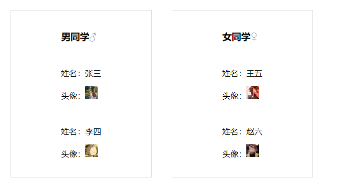
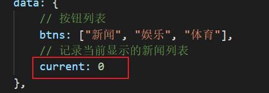
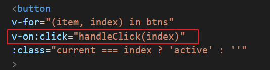
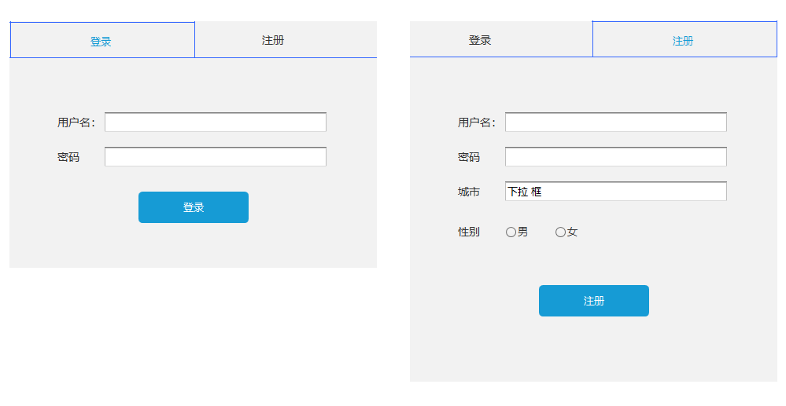
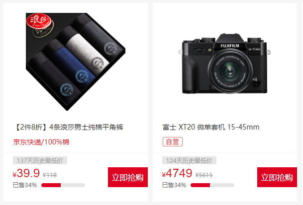
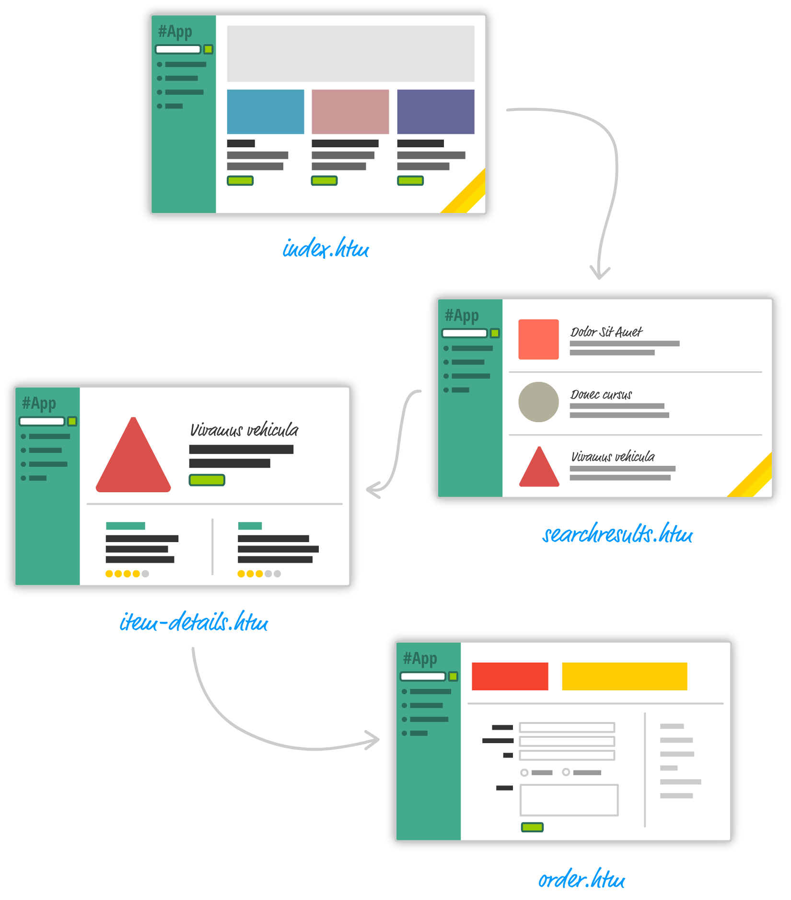
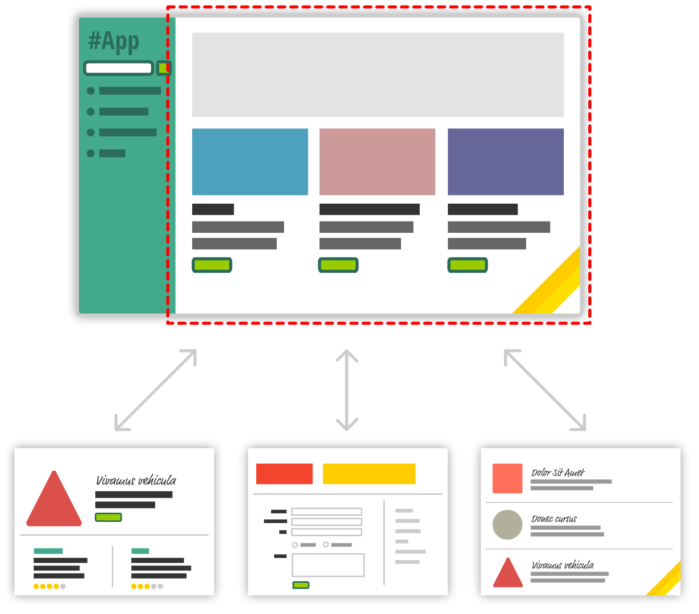

# Vue介绍


## 学前须知

**善于理解，善于总结，理科思维，文科措辞**


## 关于Vue

1. Vue是什么？

   1. 什么是框架？ ( 框架是一个常用的工具封装起来的库，优点是可以应付常见的网站开发，缺点是必须要按照作者的设计来开发)

2. 学它的目的？

   为了工作

3. 开始学习


## Vue的初体验

> 线上链接地址
>
> <script src="https://cdn.bootcss.com/vue/2.6.11/vue.min.js"></script>


```html
<div id="app">
	// 两个大括号{{}}属于vue的模板插值表达式写法，可以渲染出data中的数据
	{{message}}
</div>

// 导入vuejs的链接之后，就可以调用Vue构造函数
<script src="https://cdn.bootcss.com/vue/2.6.11/vue.min.js"></script>

<script>
// app是返回的vue实例
var app = new Vue({
	// 声明当前vue实例要控制的页面元素
	el: "#app",
    
	// data属性是el元素要用的数据
    data: {
        
    	// 页面的数据message,通过vue的模板指令可以很方便的把数据显示在页面上
    	// 开发者不需要手动的操作dom元素
        message: "hello vue!"
    }
})
</script>
```


**插值表达式内可以进行 加减乘除运算 和 运行三元表达式**


##数据驱动视图

​	**数据驱动视图**是vue最大的特点，也就是当数据发生变化的时候，用户界面发生相应的变化，开发者不需要手动的去修改dom，数据驱动视图也称为mvvm模式；


# Vue模板视图

​	在第一个例子中我们学习了，如何把`data`的`message`属性通过插值表达式`{{}}`渲染在页面中，vue的模板渲染除了插值表达式外，还有很多指令也可以实现模板渲染。

​	指令有一个很特殊的地方就是都是以`v-`开头。

## 模板指令

​	vue提供了很多指令来渲染模板，每个指令都有各自的特点和使用场景。

### v-text

**作用**

​	使用`v-text`可以往节点中渲染data数据，效果和插值表达式类似

**代码示例**

```html
<div id="app">
	<span v-text="message"></span>
</div>

<script>
	var app = new Vue({
        el: "#app",
        data: {
            message: "hello vue"
        }
	})
</script>
```

**注意**

`	v-text`指令虽然和插值都能达到同样的显示效果， 但是是有区别的

1. 比如下面使用插值表达式：

```html
<span>我要显示的内容：{{message}}</span>
```

2. 使用`v-text`指令：

```
<span v-text="message">我要显示的内容：</span>
```

> 使用了v-text指令的span标签原来的内容会被完全覆盖，通过情况下`使用插值表达式就够了`


### v-html

**作用**

​	插值表达式和 `v-text`指令都是将数据解析普通的文本字符串，如果是特殊的html字符串，则使用`v-html`指令

**代码示例**

```html
<div id="app">
	<div v-html="message"></div>
</div>

<script>
	var app = new Vue({
        el: "#app",
        data: {
        	// html字符串
            message: "<span>hello vue</span>"
        }
	})
</script>
```


### v-bind:

**作用**

​	上述指令都是往节点中插入值，如果需要改变标签的属性可以使用`v-bind:`指令。

​	常见的标签属性：如`id`、`class`、`title`，或者图片元素`img`的`src`属性等。

**代码示例**

```html
<div id="app">
	
</div>

<script>
	var app = new Vue({
        el: "#app",
        data: {
        	// 图片地址来自网络
            image: "https://www.baidu.com/img/baidu_jgylogo3.gif"
        }
	})
</script>
```

**注意**

`	v-bind：`指令可以缩写成一个冒号`:`，两者作用相等

```html

```

**扩展**

​	在v-bind绑定的属性中还可以使用字符串相加，如下，设置标签的背景颜色:

```html
<div id="app">
	<!-- 绑定动态的style,color来自data -->
	<div :style=" 'background' + color "> 红色的背景 </div>
</div>

<script>
	var app = new Vue({
        el: "#app",
        data: {
        	// 图片地址来自网络
            color: "red"
        }
	})
</script>
```


### v-for

**作用**

​	上述例子都是渲染的单个数据，如果要渲染列表数据（比如数组类型的数据），则使用`v-for`指令。

​	使用`v-for`指令可以根据列表数据渲染出多个元素节点，元素内配合`指令`来展示数据。


**`v-for`循环一共有三种结构**


**①：v-for="item in goods"**

​	依次排座。

**代码示例**

```html
<div id="app">
	<ul>
		<!-- li 就是一个循环结构 -->
		<li v-for="item in goods">
			{{item}}
		</li>
	</ul>
</div>

<script>
	var app = new Vue({
        el: "#app",
        data: {
        	// 商品数据类型为数组
            goods: [ "iphonex", "iphone8", "iphone6" ]
        }
	})
</script>
```

​	`v-for="item in goods"`结构指定了循环`goods`数据, `item`是循环体的变量代表当前项,`in`是循环体的关键字。


**②：v-for="(item, index) in goods**

​	依次排座，但是每个座位都有自己的编号。

**代码示例**

```html
<div id="app">
	<ul>
		<!-- li就是循环体 -->
		<li v-for="(item, index) in goods">
			{{index}} {{item}}
		</li>
	</ul>
</div>

// 省略js代码
```

​	循环结构中可以使用括号 () 指定多个变量，第二变量`index`是数组当前的索引。


**③：v-for="(item, key, index) in goods"**

​	此循环结构用于循环`对象数据类型`，结构中的key代表的对象的属性

**代码示例**

```html
<div id="app">
	<ul>
		<!-- li就是循环体 -->
		<li v-for="(item, key, index) in goods">
			<!-- item当前项是对象 -->
			{{index}} {{key}} {{item.price}}
		</li>
	</ul>
</div>
<script>
	var app = new Vue({
        el: "#app",
        data: {
        	// 商品数据类型为对象
            goods: {
                iphonex: {price: 10000},
                iphone8: {price: 8000},
                iphone6: {price: 6000}
            }
        }
	})
</script>
```


**注意**

​	`v-for`使用带小括号的结构可以在循环体中声明多个变量，为了便于功能的扩展（可能出现使用的索引的情况）,所以这里**`大家统一使用第二种循环数组，第三种循环对象。`**


### v-if和v-show

**作用**

​	"非黑即白"， `v-if`和`v-show`指令都是通过判断表达式的值来控制页面是否渲染该元素，**值为`true`则显示，为`false`则隐藏**


**v-if 代码示例**

```html
<div id="app">
   	<h3>学习条件渲染</h3>
	<div v-if="isShow === true">显示</div>
</div>
<script>
	var app = new Vue({
        el: "#app",
        data: {
        	isShow: true
        }
	})
</script>
```

​	上例中的数据`gender`值是`true`，所以页面会显示该div元素，如果为`false`则`dom`结构中不会渲染该元素。

​	而使用了`v-show`页面展示的效果和`v-if`是一样的，只是隐藏方式采用设置`css`的属性`display:none`

```html
<div id="app">
   	<h3>学习条件渲染</h3>
	<div v-show="isShow === true">显示</div>
</div>
```

**注意**

​	一般来说，`v-if` 有更高的切换开销，而 `v-show` 有更高的初始渲染开销。因此，如果需要非常频繁地切换，则使用` v-show` 较好；如果在运行时条件很少改变，则使用` v-if` 较好。


### 练习

​	把以下数据渲染到页面上，效果如图所示：



```html
<div id="app">
	<!-- 你的代码 -->
</div>
<script>
	var app = new Vue({
        el: "#app",
        data: {
            users: [
                {
                    name: "张三",
                    avatar: "https://avatars3.githubusercontent.com/u/57563568?s=64&v=4",
                    gender: 1
                },
                {
                    name: "李四",
                    avatar: "https://avatars1.githubusercontent.com/u/46847886?s=64&v=4",
                    gender: 1
                },
                {
                    name: "王五",
                    avatar: "https://avatars2.githubusercontent.com/u/57483340?s=64&v=4",
                    gender: 0
                },
                {
                    name: "赵六",
                    avatar: "https://avatars1.githubusercontent.com/u/26160377?s=64&v=4",
                    gender: 0
                },
            ]
        }
	})
</script>
```


> 从上例中我们会用到vue中以下的功能:
>
> 1. data声明数据
>
> 2. 插值表达式
>
> 3. v-bind: 属性绑定
>
> 4. v-for列表循环
> 5. v-if条件判断


## 模板事件@

​	vue模板绑定事件需要用到指令`v-on:`，如点击事件`onclick`，在`vue`的模板中则使用`v-on:click`来绑定点击事件


### 点击事件

**代码示例**

1. 添加事件`v-on:click="handleClick"`，值`handleClick`是点击事件处理函数，
2. 在`vue`实例的**`methods`**属性中实现该处理函数

```html
<div id="app">
    <button v-on:click="handleClick">确定</button>
</div>
<script>
    var app = new Vue({
    	el: '#app',
      	methods: {
        	handleClick: function (){
            	alert("点击了确定按钮")
        	}
      	}
    })
</script>
```

**注意**

事件绑定`v-on:`可以缩写成`@`符号，两者作用相等

```html
<button @click="handleClick">确定</button>
```


**关于事件对象**

​	第一个参数默认是事件对象event，比如通过事件对象获取点击的`dom`元素

**代码示例**

```html
<div id="app">
    <button v-on:click="handleClick">确定</button>
</div>
<script>
    var app = new Vue({
    	el: '#app',
      	methods: {
        	handleClick: function (event){
            	console.log(event)
        	}
      	}
    })
</script>
```

> 这个在第3小节的表单中会用到


### 事件传递参数

​	事件处理函数可以传递其他参数。

**代码示例**

```html
<div id="app">
    <button v-on:click="handleClick(123)">确定</button>
</div>
<script>
    var app = new Vue({
    	el: '#app',
      	methods: {
        	handleClick: function (args){
            	alert('传入的参数:' + args)
        	}
      	}
    })
</script>
```

**注意**

​	如果handleClick事件函数不传参数，那么默认的第一个参数就是event事件对象，如果像上例中传了参数，那就是传递过来的值。

**疑问**

*问：如果同时需要事件对象，又要传参怎么办？*

*答：可以在模板中传递$event属性。*

```html
 <button v-on:click="handleClick($event, 123)">确定</button>
```


### 练习`!!!`

> Tab栏案例练习


1.先给定一个current的默认值



2.给按钮绑定一个点击事件，事件中必须要传索引值（可以用循环的方式绑定事件）



3.在点击事件处理函数中修改current的值


4.添加高亮的样式active


## 表单

​	无论任何表单，其实都是为了获取表单元素的值，常见的表单元素有

`input、select、radio、textarea`等等。

### 监听输入框的值

​	监听输入框的值，在p标签中显示输入框的内容。

**代码示例**

```html
<div id="app">
    名字：<input :value="name"  @input="handleInput"></input>
	<p>{{name}}</p>
</div>
<script>
    var app = new Vue({
    	el: '#app',
        data: {
            name: ""
        },
      	methods: {
        	handleInput: function (event){
            	this.name = event.target.value
        	}
      	}
    })
</script>
```


### 双向数据绑定

​	使用`v-model`相当于给表单元素绑定了`value`属性和`input`或者`change`事件。

**代码示例**

```html
<div id="app">
    姓名：<input v-model="name"></input>
	<p>{{name}}</p>
</div>
<script>
    var app = new Vue({
    	el: '#app',
        data: {
            name: ""
        }
    })
</script>
```


### 练习

> 注册表单

有一个tab栏的面板，分别是登录和注册，默认显示登录的面板，当点击头部的注册按钮时候，

登录的面板隐藏，显示注册的面板。

再此点击头部的登录按钮，注册的面板隐藏，显示登录的面板。

**要求**

*点击登录或者注册按钮时候需要把对应的数据打印出来*



> 内容总结：
>
> 1.学会如何给dom元素绑定点击事件
>
> 2.事件可以传递参数给事件函数
>
> 3.tab栏切换
>
> 4.在vue的模板中如何获取表单的数据（双向数据绑定）


## 获取dom元素

​	Vue模板中可以使用`ref`属性来代替`document.getElementById`等方法获取Dom元素，下面是两个关键的步骤：

1. 给模板的元素(div)绑定`ref`属性，比如 `<div ref="box"></div>`

2. 在js代码使用 `this.$refs.box`获取dom元素


   实现一个点击按钮，修改盒子的背景颜色。

**代码示例**

```html
<style>
    .div {
        background: red;
        width: 50px;
        height: 50px;
        margin-bottom: 20px;
    }
</style>
<div id="app">
    <div class="div" ref="box"></div>
    <button @click="handleClick">修改颜色</button>
</div>
<script>
    var app = new Vue({
        el: '#app',
        methods: {
            handleClick: function () {
                this.$refs.box.style.background = "blue";
            }
        }
    })
</script>
```

**注意**

​	Vue并不推荐直接操作dom元素，很多情况下都可以使用其他方法来代替的，比如上面案例的效果。


## 计算属性

​	计算属性`computed`有两个基本的特性，可以简单的理解为：

1. 定义模板数据

2. 监听`this`属性的变化


### 基本使用

​	`computed`和`data`一样可以定义数据，不过`computed`属性的值是函数的返回值。

**代码示例**

```html
<div id="app">
    {{name}}
</div>
<script>
    var app = new Vue({
        el: '#app',
        computed: {
            name(){
                return "张三"
            }
        }
    })
</script>
```


### 监听作用`!!!`

​	`computed`会监听函数内部引用的`this属性`的变化，一旦`this属性`发生了变化，那么函数会重新执行并且返回新的值。

​	我们举个姓名相加的案例。

**代码示例**

```html
<div id="app">
    <input v-model="first"/> + <input v-model="last"/> 全名: {{ fullName }}
</div>
<script>
    var app = new Vue({
        el: '#app',
        data: {
            first: "",
            last: ""
        },
        computed: {
            fullName(){
                return this.first + this.last;
            }
        }
    })
</script>
```

​	由于computed函数内部引用到了`this.first`和`this.last`的属性，所以当这两个属性发生变化后，会重新发起计算得到新的值。


## 监听属性

​	watch属性可以监听`this属性`的变化， 当该`this属性`发生变化时会执行对应的函数。

### 基本使用

​	监听`data`中的数据。

**代码示例**

```html
<div id="app">
    <input v-model="name"></inpput>
</div>
<script>
    var app = new Vue({
        el: '#app',
        data: {
            name: "",
        },
        watch: {
            name(){
                console.log("我监听到了name属性发生了变化:" + this.name);
            }
        }
    })
</script>
```

**注意**

`computed`和`watch`方法都可以监听变量的变化来作出对应的操作。

**1.监听单个属性使用watch**

**2.监听多个属性使用computed**


### 监听对象

​	监听对象也叫深度监听，普通的写法不能监听对象内部属性的变化，监听对象有两种写法，比如监听`user`下的`name`属性的变化。

**代码示例**

写法一：

```html
<div id="app">
    <input v-model="user.name"></inpput>
</div>
<script>
    var app = new Vue({
        el: '#app',
        data: {
            user: {
                name: ""
            },
        },
        watch: {
            "user.name"(){
                console.log("我监听到了user变化");
            }
        }
    })
</script>
```


写法二：

```html
<div id="app">
    <input v-model="user.name"></inpput>
</div>
<script>
    var app = new Vue({
        el: '#app',
        data: {
            user: {
                name
            },
        },
        watch: {
            user: {
                deep: true,
                handler(){
                    console.log("我监听到了user变化");
                }
            }
        }
    })
</script>
```


## 综合练习

> 购物车数量加减，计算总价格


# 组件


​	到目前为止，我们已经学了`vue`的模板视图渲染了，但会发现我们一直都在 `new Vue({})`实例上进行操作的，这个实例也称为根实例，**往往我们一个应用可以很大，或者由很多的页面组成，所以不可能应用所有的内容都写在根实例中，这个时候我们要学会把应用拆分成多个模块。**


**思考**

1. 为什么要使用组件？
   1. 一个页面内容太多了，需要拆分成多个组件，并且组件具有复用的功能。
2. 如何创建组件？
   1. 全局组件的创建
   2. 局部组件的创建
   3. 组件的属性，特别是组件的data属性的声明，要使用函数
3. 组件如何传值？
4. 组件如何传递事件？


## 创建组件

​	在学习组件前我们来做一些准备工作，先初始化一个根实例，因为组件最终是要引入到根实例中。

```html
<div id="app">
	 <!-- 引用组件 -->
</div>

<script>
var app = new Vue({
    el: "app"
})
</script>
```

​	OK，一个根实例完成了，接下来就可以创建应用所需要的组件了，我们先从内容简单的组件开始，比如 "hello vue"。

**注意**

​	创建组件的方式有两种，一种是全局组件，一种是局部组件，我们通过学习来看下他们具体的区别。


### 全局组件

**介绍**

​	全局组件使用`Vue.component`的方法创建，第一个参数为组件名，第二个参数是对象由`template`属性指定组件结构

**代码示例**

```html
<div id="app">
	<!-- 2.引用组件 -->
	<children></children>
</div>

<script>
// 1.创建全局组件
Vue.component("children", {
    template: `<div>hello vue</div>`
})

new Vue({
  el: '#app'
})
</script>
```

**注意**

​	组件名，比如这里的`children`不能用大写字母，因为html不区分大小写。


### 局部组件

**介绍**

​	通过对象的方式创建了一个组件，由对象的`template`属性指定组件的结构，然后组件必须在根实例中的`components`属性中注册才能实现引用，这种创建方式称为局部组件

**代码示例**

```html
<div id="app">
	<!-- 3.引用组件 -->
	<children></children>
</div>

<script>
// 1.创建组件
var children = { template: `<div>hello vue</div>` }

new Vue({
  el: '#app',
  // 2.注册局部组件
  components: {
    children: children,
  }
})
</script>
```


> 现在已经可以解答上面的问题了
>
> **学前思考**
>
> 1. 为什么要使用组件。
>    1. 因为页面的内容会很多，所以可以拆分成多个组件来写
>    2. 组件可以多次复用
> 2. 如何创建组件。
>    1. 创建组件有两种方式，分别是全局组件和局部组件
>    2. 全局和局部只是创建方式不一样，全局使用Vue.component,局部使用对象并且要在根实例的components中注册


### 组件实例的属性

​	组件除了有`template`属性，还可以指定其他的属性，比如`data、methods、computed、watch`等，组件也是一个`Vue`的实例对象。

​	但是注意在组件定义`data`属性和根实例有区别。

**代码示例**

```html
<div id="app">
	<!-- 2.引用组件 -->
	<children></children>
</div>

<script>
// 1.创建全局组件
Vue.component("children", {
	data: function(){
        return {
            message: "hello vue"
        }
	},
    template: `<div>{{message}}</div>`
})

new Vue({
  el: '#app'
})
</script>
```

**注意**

​	**组件的`data`声明必须是一个函数**，在函数中返回一个对象，该对象内才是组件的数据。除了`data`的定义和根实例不一样外，其他属性（`methods、computed、watch`）都是一样的。

**为什么要在组件里面声明data用函数的方式**

​	因为组件具有复用性，可以调用多次，作者在设计组件时候为了组件内部的数据都是独立，所以设计成了函数的方式。


## 组件传值

​	**组件可以接收外部传入的值。**

​	如某东的商品列表，一个商品模块看做一个组件，但是每个商品展示的信息不一样，这个时候就需要往组件中传不同的值了。




### 组件的`props`

​	组件中通过`props`声明可接收的属性，然后在引用组件时传递对应的属性和值。

**代码示例**

```html
<div id="app">
	<!-- 3.引用组件 -->
	<goods-item title="原装正品 iphone x" price="10000"></goods-item>
	<!-- 4.再次引用组件-->
	<goods-item title="假一赔十 iphone 8" price="8000"></goods-item>
</div>

<script>
// 1.创建商品组件
Vue.component("goods-item", {
	// 2.定义props
	props: ["title", "price"],
    template: `<div>
    	<h4>{{title}}</h4>
    	<p>{{price}}</p>
    </div>`
})

new Vue({
  el: '#app'
})
</script>
```

**注意**

1. `props`的值是一个数组，里面声明了组件可接收的属性
2. `props`的值和`data`的值一样可以通过`this`访问，都可以在模板中渲染。


### 动态的`props`

​	上例中我们发现`props`的属性都是属于一个商品的信息，但是一个商品的信息往往是使用对象来表示的，那么组件的props也是可以接收对象类型值的。

```html
<div id="app">
	<!-- 3.引用组件 -->
	<goods-item :goods="goods1"></goods-item>
	<!-- 4.再次引用组件-->
	<goods-item :goods="goods2"></goods-item>
</div>

<script>
// 1.创建商品组件
Vue.component("goods-item", {
	// 2.定义props
	props: ["goods"],
    template: `<div>
    	<h4>{{goods.title}}</h4>
    	<p>{{goods.price}}</p>
    </div>`
})

new Vue({
  el: '#app',
  goods1: {
 	title: '原装正品 iphone x',
  	price: 10000
  },
  goods2: {
  	title: '假一赔十 iphone 8',
  	price: 8000
  }
})
</script>
```


### 单向数据流

​	单向数据流只是一个概念，表示数据是从父组件向下流动到各个子组件，这里的根实例是父组件，`goods-item`就是子组件。


## 组件传递事件

​	组件除了可以传值外还可以传递事件。


### 传递普通事件

**代码示例**

```html
<div id="app">
	<!-- 2.传递事件, myclick是事件名 -->
    <children @myclick="handleClick"></children>
</div>

<script>
    Vue.component("children", {
        mounted(){
            // 3.手动触发事件
            this.$emit("myclick")
        },
        template: `<div>这是子组件</div>`
    })

	new Vue({
        el: '#app',
        methods: {
        	// 1.传递给子组件的事件
            handleClick: function(){
                alert("子组件触发了事件")
            }
        }
    })
</script>
```

**注意**

1. `@myclick="handleClick"`，注意`myclick`是自定义事件名（不要使用大写字母）
2. 组件使用实例的`$emit`方法主动触发事件，如`this.$emit("myclick");`


### 子组件传值到父组件

​	组件之间是采用单向数据流，也就是父组件可以使用`props`往子组件传递数据，但如果想在`子组件中往父组件传递数据`，可以通过传递事件实现。

​	下面实现在根实例父组件中获取`children`子组件的数据：

**代码示例**

```html
<div id="app">
	<!-- 2.传递事件, myclick是事件名 -->
    <goods-item @myclick="handleClick"></goods-item>
</div>

<script>
    Vue.component("children", {
        data(){
            return {
                name: "children 子组件"
            }
        },
        mounted(){
            // 在子组件中使用this.@emit()触发事件时，可以通过参数传入数据
            this.$emit("myclick", this.name)
        },
        template: `<div>这是子组件</div>`
    })

	new Vue({
        el: '#app',
        methods: {
        	// 1.传递给子组件的事件, name是子组件的数据
            handleClick: function(name){
                alert("子组件触发了事件，组件的名字是：" + name)
            }
        }
    })
</script>
```


### 兄弟组件传值

​	兄弟组件传值需要依赖公共的组件-父组件，可以采用（子组件A传值------>>父组件------>>子组件B）来完成兄弟间的传值。

​	实现在输入框中输入颜色，按下回车键后显示输入的颜色方块。

**代码示例**

1.色块样式

```css
<style>
    .box{
        width:200px;
        height:200px;
        margin-top:20px;
    }
</style>
```

2.两个子组件，分别为`input-component`,`box-component`两个组件

```html
<div id="app">
    <input-component @oninput="handleInput"></input-component>
    <box-component :color="color"></box-component>
</div>

<script>
	// 输入框组件
	Vue.component("input-component", {
        methods: {
        	// 键盘回车事件
            handleEnter: function(event){
                var value = event.target.value;
                // 把颜色值返回给父组件 
                this.$emit("oninput", {color: value})
            }
        },
        template: `
        	<div> 
                请输入颜色: <input @keyup.enter="handleEnter($event)"/>
            </div>`
    })
    
    // 色块组件
    Vue.component("box-component", {
    	// 接收color属性
        props: ["color"],
        template: `
            <div :style="'background:' + color" 
                class="box">
                {{color}}
            </div>`
    })
    
    // 根实例
    new Vue({
        el: '#app',
        data: {
            color: "blue"
        },
        methods: {
        	// 提供给输入框组件的事件，返回输入的颜色并重置色块组件引用的color
            handleInput: function(data){
                this.color = data.color
            }
        }
    })
</script>
```


### 练习

> 加入购物车


# 路由

这里的路由（导航）指的是页面之间的跳转，在Vue中页面的跳转就是**组件之间的切换**。

官网地址：https://router.vuejs.org/zh/


## 单页应用

**传统的多页模式**

我们可以看看下面的应用结构：



​	在老式的多页设计方式下，页面在切换跳转时，网页应用会跳转到一个**全新的页面**，在今天，这种传统的多页开发模式已经过时了！

**新的解决方案**

​	目前的网页应用都是趋向于一种称为 **单页应用(SPA)** 的开发模式，这种模式我们不需要跳转到全新的页面，甚至不需要重新加载页面，只需要切换组件来显示不同的页面。

​	在单页模式下，我们的应用可以这样来显示




**思考**

1. 为什么要使用路由？

2. 怎么定义Vue路由？

3. 如何获取路由的参数？

4. 如何使用路由的方法？比如跳转到下一页。


## 定义路由

> Vue路由需要多引入和js文件:
>
> <script src="https://cdn.bootcss.com/vue-router/3.1.3/vue-router.min.js"></script>

​	

我们先来创建一个简单的登录/注册页，让应用根据url地址变化切换不同的组件，路由的实现并不复杂，只要我们记住几个关键步骤和两个`vue-router`提供的组件

**四个步骤**

1. 创建所需要的页面组件
2. 定义路由配置，只要是把路径和组件关联起来
3. 创建路由实例，需要使用第2步的数组配置
4. 挂载到根实例

**两个组件**

1. `route-link`设置导航，通过 `to` 属性指定链接（链接在步骤2配置中获得）
2. `router-view`把匹配到的组件渲染到当前位置

**代码示例**

```html
<div id="app">

    <!-- 使用 router-link 组件来导航. -->
    <!-- 通过传入 `to` 属性指定链接. -->
    <!-- <router-link> 默认会被渲染成一个 `<a>` 标签 -->
    <p>
        <router-link to="/login">登录</router-link>
        <router-link to="/register">注册</router-link>
    </p>
    
    <!-- 路由匹配到的组件将渲染在这里 -->
    <router-view></router-view>
</div>

<script>
    
    // 1.创建局部的登录和注册组件
    var Login = {template: `<div>登录页</div>`};
    var Register = {template: `<div>注册页</div>`};

    // 2.定义路由配置,一个路径对应一个组件
    var routes = [
        {path: "/login", component: Login},
        {path: "/register", component: Register}
    ]

    // 3.创建路由实例，传入routes配置
    var router = new VueRouter({
        routes
    })
    
    // 4.挂载到根实例
	new Vue({
        el: '#app',
        router: router
    })
</script>
```


## 嵌套子路由

​	在路由中还是可以设置子路由，在路由配置中通过`children`属性指定，用个人博客的应用来举例，`url`设计如下:

1. 首页：`/`
2. 用户详情页: `/user`
3. 用户详情文章页: `/user/post`
4. 用户详情评论页: `/user/comment`

**代码示例**

```html
<div id="app">
    <p>
        <router-link to="/user">跳转到用户信息页</router-link>
    </p>

    <router-view></router-view>
</div>
<script>
    // 用户组件
    var User = {
        data: function(){
            return {
                id: "",
            }
        },
        template: `<div>
            <p>用户信息</p>
            <p>用户名: 我是谁</p>

            <!-- 子路由导航链接 -->
            <router-link to="/user/post">文章</router-link>
            <router-link to="/user/comment">评论</router-link>

            <!-- [重点] 子路由匹配的组件渲染位置 -->
            <router-view></router-view>
        </div>`
    };
    
    // 文章组件
    var Post = { template: "<p>文章列表页</p>" };
    
    // 评论组件
    var Comment = { template: "<p>评论列表页</p>" };
	
    // 路由配置
    var routes = [
        {
            path: "/user", 
            component: User,
            // 配置子路由，子路由的path不用带斜杆
            children: [
                { path: "post", component: Post },
                { path: "comment", component: Comment }
            ]
        },
    ]

    var router = new VueRouter({
        routes
    })

	new Vue({
        el: '#app',
        router: router
    })
</script>
```


**实现子路由的步骤**

1. 在父组件中通过`router-view`指定渲染位置
2. 在路由配置中通过`children`配置子路由，注意`path`不用带斜杆,其他配置同父级


## 路由重定向

​	路由重定向在路由配置通过`redirect`属性来指定，往往用于路由之间的跳转，在日常浏览器网页也是非常常见的。

​	比如我们修改上例的路由配置如下

```js
	// 路由配置
    var routes = [
        {
            path: "/",
            redirect: "/user"
        },
        {
            path: "/user", 
            component: User,
            // 配置子路由，子路由的path不用带斜杆
            children: [
                { path: "post", component: Post },
                { path: "comment", component: Comment }
            ]
        },
    ]
```

​	打开首页会自动重定向到`/user`


## 路由对象

​	组件可以通过`this.$route`属性获取路由对象的详细信息，常用于获取路由的参数。

### 路由的参数

​	通过实例的`this.$route.query`获取`url`的参数，`this.$route.query`的返回值是一个对象。

​	下面我们来实现一个案例，根据`url`中的姓名和年龄参数来把值显示在页面上。

**代码示例**

1.初始化组件结构

```html
<div id="app">
    <p>
    	<!-- 地址栏中携带参数 -->
        <router-link to="/user?name=myname&age=18">登录</router-link>
    </p>
    <router-view></router-view>
</div>

<script>
    var User = {
    	// 组件的数据
        data: function(){
            return {
                name: "",
                age: ""
            }
        },
        // 生命周期函数，将在此处执行获取参数，并设置到data
        mounted: function(){

        },
        template: `<div>
            <p>用户信息</p>
            <p>姓名: {{name}}</p>
            <p>年龄: {{age}}</p>
        </div>`
    };

    var routes = [
        {path: "/user", component: User},
    ]

    var router = new VueRouter({
        routes
    })

	new Vue({
        el: '#app',
        router: router
    })
</script>
```

2.开始获取

```js
// ...
mounted: function(){
	// query是一个对象
    var query = this.$route.query;
    this.name = query.name;
    this.age = query.age;
},
// ...
```


### 动态路由参数

​	`vue-router`还提供了匹配动态路由参数，通过`$route.params`来获取。

​	和普通的路由参数相比，**动态路由参数的"路径"会显得稍微美观一点**。

**代码示例**

1.初始化结构

```html
<div id="app">
    <p>
    	<!-- 动态路由参数 -->
        <router-link to="/user/100">登录</router-link>
    </p>
    <router-view></router-view>
</div>
<script>
    var User = {
        data: function(){
            return {
                id: "",
            }
        },
        // 预留获取路由参数
        mounted: function(){
            
        },
        template: `<div>
            <p>用户信息</p>
            <p>用户id: {{id}}</p>
        </div>`
    };

    var routes = [
        {path: "/user/:id", component: User},
    ]

    var router = new VueRouter({
        routes
    })
 
	new Vue({
        el: '#app',
        router: router
    })
</script>
```


2.获取参数

```js
// ...
mounted: function(){
    var query = this.$route.params;
    this.id = query.id;
},
// ...
```


## 路由的方法

​	`this.$router`：属性可以调用路由对象的方法，比如跳转到下一页和返回上一页。

1. `this.$router.push`方法实现跳转，该函数参数接收要跳转的路径，

2. `this.$router.back`方法实现返回上一页

3. `this.$router.replace`方法替换当前页面

**代码示例**

```html
<div id="app">
    <div>
        <button @click="handleClick">登录</button>
    </div>
    <router-view></router-view>
</div>
<script>

    // 登录组件
    var Login = {
        methods: {
            // 返回上一页
            handleBack: function(){
                this.$router.back();
            }
        },
        template: `
            <div>
                登录页
                <p><input/></p>
                <p><button>确认</button></p>
                <button @click="handleBack">返回上一页</button>
            </div>
        `
    };

    var routes = [
        {path: "/login", component: Login}
    ]

    var router  = new VueRouter({
        routes: routes
    })

    new Vue({
        el: "#app",
        router: router,
        methods: {
            // 跳转到登录页的事件
            handleClick: function(){
                // 通过路由对象的push方法给路由新增一条记录，实现跳转
                this.$router.push("/login");
            }
        }
    })
</script>
```


# 项目准备

## 脚手架工具

官网地址：<https://cli.vuejs.org/zh/>

**1.下载命令**

```shell
npm install -g @vue/cli
```

上面的命令安装成功之后，可以在命令行使用vue命令了，通过vue的命令来创建项目

**注意：执行下面的命令直接生成一个vue的项目，所以要在你想要存放项目的文件夹中执行**


**2.比如我要把项目生成到桌面**


```shell
vue create news
```

> news 是项目的名字，可以修改的，执行命令时候一直回车。


## 原型图


