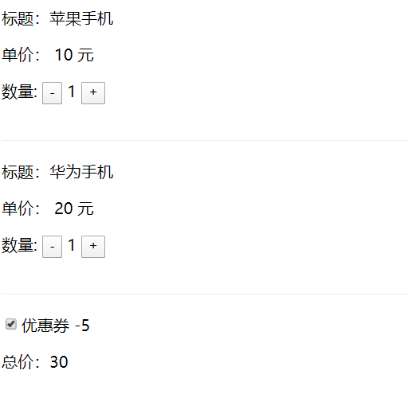

## 获取dom元素

​	Vue模板中可以使用`ref`属性来代替`document.getElementById`等方法获取Dom元素，下面是两个关键的步骤：

1. 给模板的元素(div)绑定`ref`属性，比如 `<div ref="box"></div>`
2. 在js代码使用 `this.$refs.box`获取dom元素


   实现一个点击按钮，修改盒子的背景颜色。

**代码示例**

```html
<style>
    .div {
        background: red;
        width: 50px;
        height: 50px;
        margin-bottom: 20px;
    }
</style>
<div id="app">
    <div class="div" ref="box"></div>
    <button @click="handleClick">修改颜色</button>
</div>
<script>
    var app = new Vue({
        el: '#app',
        methods: {
            handleClick: function () {
                this.$refs.box.style.background = "blue";
            }
        }
    })
</script>
```

**注意**

​	Vue并不推荐直接操作dom元素，很多情况下都可以使用其他方法来代替的，比如上面案例的效果。


## 计算属性

​	计算属性`computed`有两个基本的特性，可以简单的理解为：

1. 定义模板数据
2. 监听`this`属性的变化


### 基本使用

​	`computed`和`data`一样可以定义数据，不过`computed`属性的值是函数的返回值。

**代码示例**

```html
<div id="app">
    {{name}}
</div>
<script>
    var app = new Vue({
        el: '#app',
        computed: {
            name(){
                return "张三"
            }
        }
    })
</script>
```


### 监听作用`!!!`

​	`computed`会监听函数内部引用的`this属性`的变化，一旦`this属性`发生了变化，那么函数会重新执行并且返回新的值。

​	我们举个姓名相加的案例。

**代码示例**

```html
<div id="app">
    <input v-model="first"/> + <input v-model="last"/> 全名: {{ fullName }}
</div>
<script>
    var app = new Vue({
        el: '#app',
        data: {
            first: "",
            last: ""
        },
        computed: {
            fullName(){
                return this.first + this.last;
            }
        }
    })
</script>
```

​	由于computed函数内部引用到了`this.first`和`this.last`的属性，所以当这两个属性发生变化后，会重新发起计算得到新的值。


## 监听属性

​	watch属性可以监听`this属性`的变化， 当该`this属性`发生变化时会执行对应的函数。

### 基本使用

​	监听`data`中的数据。

**代码示例**

```html
<div id="app">
    <input v-model="name"></inpput>
</div>
<script>
    var app = new Vue({
        el: '#app',
        data: {
            name: "",
        },
        watch: {
            name(){
                console.log("我监听到了name属性发生了变化:" + this.name);
            }
        }
    })
</script>
```

**注意**

`computed`和`watch`方法都可以监听变量的变化来作出对应的操作。

**1.监听单个属性使用watch**

**2.监听多个属性使用computed**


### 监听对象

​	监听对象也叫深度监听，普通的写法不能监听对象内部属性的变化，监听对象有两种写法，比如监听`user`下的`name`属性的变化。

**代码示例**

写法一：

```html
<div id="app">
    <input v-model="user.name"></inpput>
</div>
<script>
    var app = new Vue({
        el: '#app',
        data: {
            user: {
                name: ""
            },
        },
        watch: {
            "user.name"(){
                console.log("我监听到了user变化");
            }
        }
    })
</script>
```


写法二：

```html
<div id="app">
    <input v-model="user.name"></inpput>
</div>
<script>
    var app = new Vue({
        el: '#app',
        data: {
            user: {
                name
            },
        },
        watch: {
            user: {
                deep: true,
                handler(){
                    console.log("我监听到了user变化");
                }
            }
        }
    })
</script>
```


## 综合练习

> 购物车数量加减，计算总价格

**要求：点击数量和选择优惠券计算总价格**

