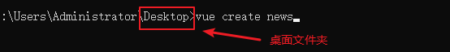

# 路由

这里的路由（导航）指的是页面之间的跳转，在Vue中页面的跳转就是**组件之间的切换**。

官网地址：https://router.vuejs.org/zh/


## 单页应用

**传统的多页模式**

我们可以看看下面的应用结构：


​	在老式的多页设计方式下，页面在切换跳转时，网页应用会跳转到一个**全新的页面**，在今天，这种传统的多页开发模式已经过时了！

**新的解决方案**

​	目前的网页应用都是趋向于一种称为 **单页应用(SPA)** 的开发模式，这种模式我们不需要跳转到全新的页面，甚至不需要重新加载页面，只需要切换组件来显示不同的页面。

​	在单页模式下，我们的应用可以这样来显示


**思考**

1. 为什么要使用路由？
2. 怎么定义Vue路由？
3. 如何获取路由的参数？
4. 如何使用路由的方法？比如跳转到下一页。

## 定义路由

> Vue路由需要多引入和js文件:
>
> <script src="https://cdn.bootcss.com/vue-router/3.1.3/vue-router.min.js"></script>

​	

我们先来创建一个简单的登录/注册页，让应用根据url地址变化切换不同的组件，路由的实现并不复杂，只要我们记住几个关键步骤和两个`vue-router`提供的组件

**四个步骤**

1. 创建所需要的页面组件
2. 定义路由配置，只要是把路径和组件关联起来
3. 创建路由实例，需要使用第2步的数组配置
4. 挂载到根实例

**两个组件**

1. `route-link`设置导航，通过 `to` 属性指定链接（链接在步骤2配置中获得）
2. `router-view`把匹配到的组件渲染到当前位置

**代码示例**

```html
<div id="app">

    <!-- 使用 router-link 组件来导航. -->
    <!-- 通过传入 `to` 属性指定链接. -->
    <!-- <router-link> 默认会被渲染成一个 `<a>` 标签 -->
    <p>
        <router-link to="/login">登录</router-link>
        <router-link to="/register">注册</router-link>
    </p>
    
    <!-- 路由匹配到的组件将渲染在这里 -->
    <router-view></router-view>
</div>

<script>
    
    // 1.创建局部的登录和注册组件
    var Login = {template: `<div>登录页</div>`};
    var Register = {template: `<div>注册页</div>`};

    // 2.定义路由配置,一个路径对应一个组件
    var routes = [
        {path: "/login", component: Login},
        {path: "/register", component: Register}
    ]

    // 3.创建路由实例，传入routes配置
    var router = new VueRouter({
        routes
    })
    
    // 4.挂载到根实例
	new Vue({
        el: '#app',
        router: router
    })
</script>
```


## 嵌套子路由

​	在路由中还是可以设置子路由，在路由配置中通过`children`属性指定，用个人博客的应用来举例，`url`设计如下:

1. 首页：`/`
2. 用户详情页: `/user`
3. 用户详情文章页: `/user/post`
4. 用户详情评论页: `/user/comment`

**代码示例**

```html
<div id="app">
    <p>
        <router-link to="/user">跳转到用户信息页</router-link>
    </p>

    <router-view></router-view>
</div>
<script>
    // 用户组件
    var User = {
        data: function(){
            return {
                id: "",
            }
        },
        template: `<div>
            <p>用户信息</p>
            <p>用户名: 我是谁</p>

            <!-- 子路由导航链接 -->
            <router-link to="/user/post">文章</router-link>
            <router-link to="/user/comment">评论</router-link>

            <!-- [重点] 子路由匹配的组件渲染位置 -->
            <router-view></router-view>
        </div>`
    };
    
    // 文章组件
    var Post = { template: "<p>文章列表页</p>" };
    
    // 评论组件
    var Comment = { template: "<p>评论列表页</p>" };
	
    // 路由配置
    var routes = [
        {
            path: "/user", 
            component: User,
            // 配置子路由，子路由的path不用带斜杆
            children: [
                { path: "post", component: Post },
                { path: "comment", component: Comment }
            ]
        },
    ]

    var router = new VueRouter({
        routes
    })

	new Vue({
        el: '#app',
        router: router
    })
</script>
```


**实现子路由的步骤**

1. 在父组件中通过`router-view`指定渲染位置
2. 在路由配置中通过`children`配置子路由，注意`path`不用带斜杆,其他配置同父级


## 路由重定向

​	路由重定向在路由配置通过`redirect`属性来指定，往往用于路由之间的跳转，在日常浏览器网页也是非常常见的。

​	比如我们修改上例的路由配置如下

```js
	// 路由配置
    var routes = [
        {
            path: "/",
            redirect: "/user"
        },
        {
            path: "/user", 
            component: User,
            // 配置子路由，子路由的path不用带斜杆
            children: [
                { path: "post", component: Post },
                { path: "comment", component: Comment }
            ]
        },
    ]
```

​	打开首页会自动重定向到`/user`


## 路由对象

​	组件可以通过`this.$route`属性获取路由对象的详细信息，常用于获取路由的参数。

### 路由的参数

​	通过实例的`this.$route.query`获取`url`的参数，`this.$route.query`的返回值是一个对象。

​	下面我们来实现一个案例，根据`url`中的姓名和年龄参数来把值显示在页面上。

**代码示例**

1.初始化组件结构

```html
<div id="app">
    <p>
    	<!-- 地址栏中携带参数 -->
        <router-link to="/user?name=myname&age=18">登录</router-link>
    </p>
    <router-view></router-view>
</div>

<script>
    var User = {
    	// 组件的数据
        data: function(){
            return {
                name: "",
                age: ""
            }
        },
        // 生命周期函数，将在此处执行获取参数，并设置到data
        mounted: function(){

        },
        template: `<div>
            <p>用户信息</p>
            <p>姓名: {{name}}</p>
            <p>年龄: {{age}}</p>
        </div>`
    };

    var routes = [
        {path: "/user", component: User},
    ]

    var router = new VueRouter({
        routes
    })

	new Vue({
        el: '#app',
        router: router
    })
</script>
```

2.开始获取

```js
// ...
mounted: function(){
	// query是一个对象
    var query = this.$route.query;
    this.name = query.name;
    this.age = query.age;
},
// ...
```


### 动态路由参数

​	`vue-router`还提供了匹配动态路由参数，通过`$route.params`来获取。

​	和普通的路由参数相比，**动态路由参数的"路径"会显得稍微美观一点**。

**代码示例**

1.初始化结构

```html
<div id="app">
    <p>
    	<!-- 动态路由参数 -->
        <router-link to="/user/100">登录</router-link>
    </p>
    <router-view></router-view>
</div>
<script>
    var User = {
        data: function(){
            return {
                id: "",
            }
        },
        // 预留获取路由参数
        mounted: function(){
            
        },
        template: `<div>
            <p>用户信息</p>
            <p>用户id: {{id}}</p>
        </div>`
    };

    var routes = [
        {path: "/user/:id", component: User},
    ]

    var router = new VueRouter({
        routes
    })
 
	new Vue({
        el: '#app',
        router: router
    })
</script>
```


2.获取参数

```js
// ...
mounted: function(){
    var query = this.$route.params;
    this.id = query.id;
},
// ...
```


## 路由的方法

​	`this.$router`：属性可以调用路由对象的方法，比如跳转到下一页和返回上一页。

1. `this.$router.push`方法实现跳转，该函数参数接收要跳转的路径，
2. `this.$router.back`方法实现返回上一页
3. `this.$router.replace`方法替换当前页面

**代码示例**

```html
<div id="app">
    <div>
        <button @click="handleClick">登录</button>
    </div>
    <router-view></router-view>
</div>
<script>

    // 登录组件
    var Login = {
        methods: {
            // 返回上一页
            handleBack: function(){
                this.$router.back();
            }
        },
        template: `
            <div>
                登录页
                <p><input/></p>
                <p><button>确认</button></p>
                <button @click="handleBack">返回上一页</button>
            </div>
        `
    };

    var routes = [
        {path: "/login", component: Login}
    ]

    var router  = new VueRouter({
        routes: routes
    })

    new Vue({
        el: "#app",
        router: router,
        methods: {
            // 跳转到登录页的事件
            handleClick: function(){
                // 通过路由对象的push方法给路由新增一条记录，实现跳转
                this.$router.push("/login");
            }
        }
    })
</script>
```


# 项目准备

## 脚手架工具

官网地址：<https://cli.vuejs.org/zh/>

**1.下载命令**

```shell
npm install -g @vue/cli
```

上面的命令安装成功之后，可以在命令行使用vue命令了，通过vue的命令来创建项目

**注意：执行下面的命令直接生成一个vue的项目，所以要在你想要存放项目的文件夹中执行**


**2.比如我要把项目生成到桌面**



```shell
vue create news
```

> news 是项目的名字，可以修改的，执行命令时候一直回车。


## 原型图