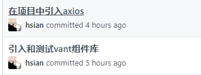

# 登录页

1. 创建登录页
2. 引入图标库
3. 登录页面布局

4. 提交表单


## 创建登录页

1.在`src/views`文件夹新建一个`Login.vue`组件

```vue
<template>
    <div>登录页</div>
</template>
<script>
export default {
    
};
</script>
<style>
</style>
```

2.新建时候通过“shift+左侧的尖括号”，在提示栏选择第一个再确定，就会出来已vue组件模板

3.配置路由

`src/router/index.js`

```js
// 路由配置
const routes = [
	{
		path: "/login",
		// 除了首页之外的页面都可以用懒加载,@符号代表的src这个目录
		// .vue这个扩展名可以忽略
		component: () => import("@/views/Login")
	}
]
```


**4.在浏览器中打开<http://localhost:8080/login>就可以看到登录组件的内容了**


## 登录页实现

**1.登录页静态布局的代码***

代码地址：<https://github.com/itcast-hsian/news-43/commit/849b2f71f3e54e1754d9c30ace396ed98210245b>

**2.登录的样式**

代码地址：<https://github.com/itcast-hsian/news-43/commit/52c722d151ebb5d3891447d91989408aadfdde32>

**3.根据下面的文档引入vant和axios**	



**4.提交登录的请求**

代码地址：<https://github.com/itcast-hsian/news-43/commit/1ee79bbe6a2b0cb326e0619d27cf349f58186ed3>

**5.登陆成功的弹窗**

代码地址：<https://github.com/itcast-hsian/news-43/commit/09e4f88b891ea81ff1891589c3559cea4d68327e>

**6.因为自己的登录表单没有校验，所以引入vant的表单**

代码地址：<https://github.com/itcast-hsian/news-43/commit/2bd7faeaf6e48b9b0d6c9a9db3cec5cb047ad056>

**7.修改vant表单的样式，并且提交登录成功**

代码地址：<https://github.com/itcast-hsian/news-43/commit/14929463d22cffb240f0f9cf69ea2effc2f8381f>


# vant-ui组件库

[官网地址](https://youzan.github.io/vant/#/zh-CN/intro)

1. 下载命令
2. 配置
3. 测试使用


## 下载命令

```
npm install vant
```


## 配置

**全局引入所有组件**

> 注意：还有[其他的引入方式](https://youzan.github.io/vant/#/zh-CN/quickstart#yin-ru-zu-jian)，各有优点。
>
> 全局引入好处是只引入一次，就可以在任何页面中使用。
>
> 缺点是用不到的组件也会打包进来。

`src/main.js`

```js
import Vue from 'vue';
import Vant from 'vant';

Vue.use(Vant);

// 其他代码...
```

**导入样式**

`src/App.vue`

```vue
<style>
@import url('../node_modules/vant/lib/index.css');

/* 其他代码... */
</style>
```


## 测试使用

测试弹窗，[toast组件](https://youzan.github.io/vant/#/zh-CN/toast)

```vue
<template>
	<button @click="$toast('弹窗测试')">测试弹窗</button>    
</template>
<script>
    export default {

    }
</script>
```


# Axios异步请求库

[官网地址](https://github.com/axios/axios)

1. 下载命令
2. 配置
3. 测试使用


## 下载命令

```
npm install axios
```


## 配置

`src/main.js`

```js
import axios from "axios";

// 绑定到原型
Vue.prototype.$axios = axios;

// 添加基准路径
axios.defaults.baseURL = "http://localhost:3000"

// 其他代码...
```


## 测试使用

```js
// get请求
// method默认是get
// params是get请求的参数
this.$axios({
    url: "/post",
    method: 'GET', 
    params: {
        id: 1
    }
}).then(res => {
    console.log(res)
})

// post请求
// method是POST
// data是post请求的参数
this.$axios({
    url: "/login",
    method: 'POST',
    data: this.form
}).then(res => {
    console.log(res)
})
```


# 注册页

1. 注册页面布局
2. 表单绑定数据
3. 表单验证
4. 提交表单

> 步骤参考登录页


**1.新建注册页，在登录页跳转到注册页面的按钮**

代码地址：<https://github.com/itcast-hsian/news-43/commit/b9409222829a82860123b0f6b6d11f2f58000438>

**2.注册成功**

代码地址：<https://github.com/itcast-hsian/news-43/commit/4f45d4900cd3aa3bb04f490da6fb9184c14d2187>


# 给样式添加scoped

代码地址：<https://github.com/itcast-hsian/news-43/commit/5edf2e051675274f50072b98b03c826eb7c2da40>

```css
<style lang="less" scoped>

</style>
```

**每个页面的组件都要加上scoepd,** scoped的作用就是让样式只对当前的组件有效果，避免影响到其他的组件，

但是App.vue不要，因为App.vue是存放公共的要样式


