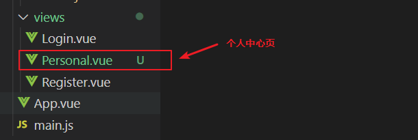
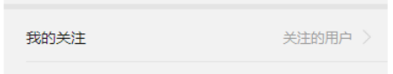
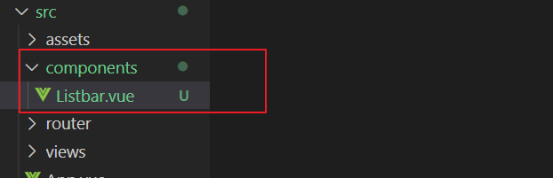
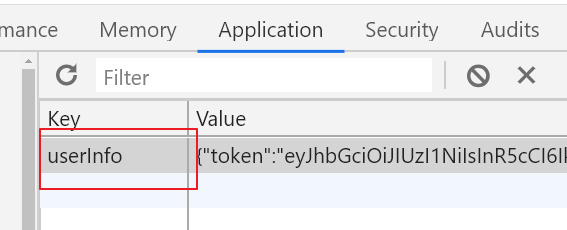
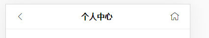
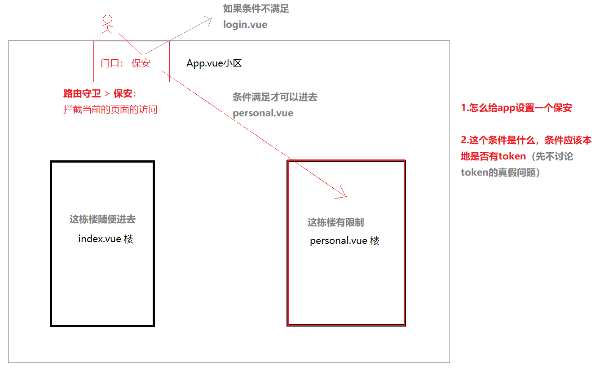
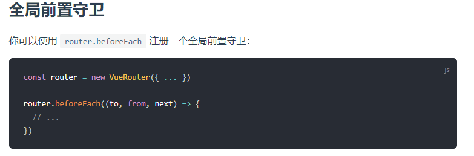

# 个人中心页

1. 创建一个个人中心页（路径是： /personal）
2. 页面静态布局
3. 列表按钮栏组件封装


## 创建一个个人中心页

代码地址：<https://github.com/itcast-hsian/news-43/commit/210729692a0600bbd55313ed2aee136dbe06f74c>

1.在`src/views`中创建一个`personal.vue`



创建完毕随便给template先加个内容

```
<template>
  <div>个人中心</div>
</template>
```

2.配置路由

在路由的配置中添加多一项

```
{
    // 个人中心页
    path: "/personal",
    component: () => import("@/views/Personal")
}
```

3.手动在浏览器打开地址<http://localhost:8080/personal>预览


## 页面静态布局

参考提交代码

代码地址：https://github.com/itcast-hsian/news-43/commit/9ad82e97a6d3e8c1cdc1b44f24f137007f63ccd0

https://github.com/itcast-hsian/news-43/commit/88befaf9b5d10390207a7ad39d1252b289d4480f


## 列表按钮栏组件封装

代码地址：https://github.com/itcast-hsian/news-43/commit/6194d2f7ca7c15a2c8061f2e20ff89e8aab826d3

https://github.com/itcast-hsian/news-43/commit/0e3affb94c0334dcf35f658957f289d947ab630e





**1.在`src/components`新建一个文件`Listbar.vue`**



**2.添加组件的内容**

包含布局和样，样式参考提交的代码

```vue
<template>
    <!-- 列表按钮栏 -->
    <div class="listbar">
        <router-link to="#">
            <div>我的关注</div>
            <div class="tips">
                关注的用户
                <span class="iconfont iconjiantou1"></span>
            </div>
        </router-link>
    </div>
</template>
```

**3.把组件导入到`src/views/personal.vue`**

**一定要注意：要在script标签里面导入，并且一定是写在export default {}的上面**

```vue
<script>
    // 导入列表按钮栏的组件，import后面接上的组件变量名（变量就意味着可以随便改名字）
    // @代表src目录
    import Listbar from "@/components/Listbar"

    export default {
        // 注册组件,导入的子组件都必须注册才可以再模板渲染
        components: {
            Listbar
        }
    };
</script>
```

然后就可以在模板中调用了,模板`template`

```
<!-- 组件的调用，单双标签都可以 -->
<Listbar/>
```


**4.给`src/components/Listbar.vue`组件添加props**

```vue
<script>
export default {
    // 声明组件可以接收的属性, label表示左边的文字, tips是右边的文字
    props: ["label", "tips"],
};
</script>
```


**5.通过自定义的data数据循环出多个Listbar**

`src/views/personal`

```js
export default {
	data(){
		return {
			// 组织一个列表按钮栏的数据
			rows: [
				{ label: "我的关注", tips: "关注的用户" },
				{ label: "我的跟帖", tips: "跟帖回复" },
				{ label: "我的收藏", tips: "文章视频" },
				{ label: "设置", tips: "" },
			]
		}
	},
    // ....
};
```


然后可以在模板中循环渲染上面的数据

```vue
<!-- 组件的调用，单双标签都可以 -->
<!-- :key不是报错，可以不加，
但是vue希望给循环的元素指定“唯一的key”，所以推荐我们在循环时候都加上 -->
<Listbar v-for="(item, index) in rows" :key="index"
         :label="item.label" 
         :tips="item.tips"/>
```


## 请求个人的详情

代码地址：https://github.com/itcast-hsian/news-43/commit/05b38dad9874e04ddde117e00d42998eb877d040

https://github.com/itcast-hsian/news-43/commit/65010d4e5818b7e64a4d257ad8be2490d843d1b8


请求个人的信息肯定都是需要授权登录的，必须给接口提供token，保证当前是一个登录的状态，接口还需要提供你的用id


**1.获取用户id和token，在登录成功后把用户的数据保存到本地**

`src/views/login`

```js
.then(res => {
    // 获取到返回的信息, data是token和用户的信息，data是保存到本地的
    const {message, data} = res.data;
    // 使用vant的弹窗提示用，success表示成功的弹窗
    this.$toast.success(message);

    // 把token和id保存到本地
    // localStorage只能保存字符串，需要使用JSON.stringify来把对象转换成字符串
    localStorage.setItem("userInfo", JSON.stringify(data));

    // 先暂时登录成功跳转个人中心页
    this.$router.push("/personal");
})
```

查看浏览器是否保存成功




**2.回到个人中心页请求个人的详情数据**

根据本地的token和id请求个人的详情数据

`src/views/personal.vue`

```js
// 组件加载完毕后触发，类似window.onload
mounted(){
    // 从本地获取token和id
    const jsonStr = localStorage.getItem("userInfo");
    // 把字符串转成对象,userJson就是用户的信息对象
    // userJson.token和userJson.user.id 这两个值是接口需要的
    const userJson = JSON.parse(jsonStr);

    // 发起异步的请求
    this.$axios({
        url: "/user/" +   userJson.user.id,
        // 添加头信息
        headers: {
            Authorization: userJson.token
        }
    }).then(res => {
        console.log(res)
    })
}
```


## 渲染页面的数据

代码地址：https://github.com/itcast-hsian/news-43/commit/afcc822cc46f6476414b94482cfe4c7f150b94a5


**1.注意在渲染头像时候需要加上基准路径**

我们的头像的图片是来自于后台的，所以需要加上后台地址，地址可以直接读取axios的基准路径，好处就是以后只需要修改基准的路径，整个网站都会发生变化。（网站上线的时候不能再用localhost本地域名，需要绑定线上的域名），

```

```


### 日期格式的转换

1.下载安装momentjs

```shell
npm install --save moment
```

2.在页面中引入，并且挂载到data；

`src/views/personal.vue`

```js
// 引入第三方的日期格式处理的工具库
import moment from "moment";

export default {
	data(){
		return {
			
			// moment是日期处理的工具库，为了在模板中可以使用，所以需要绑定在data中
			moment,
		}
	},
```


3.可以在模板中使用moment转换时间

format('YYYY-MM-DD')里面的四个Y表示年份，MM表示月份, DD表示日期

```js
<p>{{ moment(userInfo.create_date).format('YYYY-MM-DD') }}</p>
```


## 添加顶部的导航栏

代码地址：https://github.com/itcast-hsian/news-43/commit/4c3fea3bc91ef3970b5d7cdce965b79383c6828a




## 退出

代码地址：https://github.com/itcast-hsian/news-43/commit/6c982382e59019e9b3583f9cec104319ef2bd19f


1.给退出的按钮组件添加一个点击事件

`src/views/personal.vue`

```html
<!-- handleClick点击退出按钮时候触发 -->
<!-- click.native这个事件类型，会给Listbar这个组件最外部的div强制绑定点击事件
不要去跟事件传递作比较 -->
<Listbar @click.native="handleClick" label="退出"/>
```

> click.native这个事件类型，会给Listbar这个组件最外部的div强制绑定点击事件

2.点击触发的退出事件

```js
// 退出的事件
handleClick(){
    // 询问用户是否确定退出
    this.$dialog.confirm({
        title: '提示',
        message: '确定退出吗？'
    }).then(() => {
        // 点击确定时候触发的函数

        // 清除本地的存储的用户数据
        localStorage.removeItem("userInfo");
        // 跳转到登录页,必须要使用replace。因为退出不可能再返回个人中心
        this.$router.replace("/login");
    }).catch(() => {
        // 点击取消按钮触发的函数
    });
}
```


## 路由守卫

代码地址：https://github.com/itcast-hsian/news-43/commit/f0946c62b88e294ff45adc5d1f63824121a6643c

****


官网地址：<https://router.vuejs.org/zh/>

导航守卫：<https://router.vuejs.org/zh/guide/advanced/navigation-guards.html>








`src/main.js`

```js
// 添加路由的守卫
// to: 代表你即将要访问的页面
// from：代表你即将要离开的页面
// next：必须要调用，next就类似于你nodejs的中间件，调用才会加载后面的内容
router.beforeEach((to, from, next) => {
  // 判断是否去的个人中心页
  if(to.path === "/personal"){
    // 判断是否是登录状态，时候有token
    // 如果本地的数据是空会返回null，null是没有token属性，会导致js报错，
    // 所以可以加个判断，如果本地的数据空的，等于空的对象
    const userJson = JSON.parse(localStorage.getItem('userInfo')) || {};

    // 有token可以正常访问
    if(userJson.token){
      next();
    }else{
      // 跳转到登录页,next这个函数可以传递路径，并且会跳转该路径
      next("/login");
    }
  }else{
    // 非个人中心页
    next();
  }
})
```


# 编辑资料页面

明天内容

