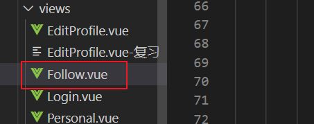
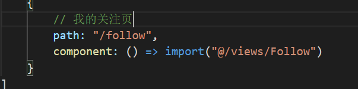
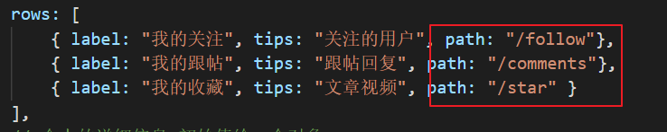
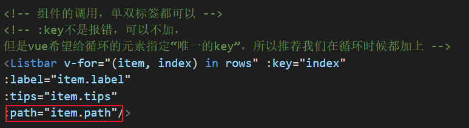
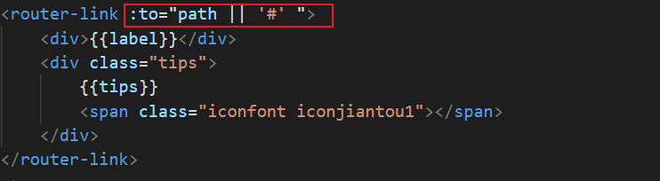
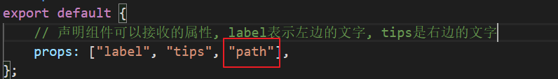
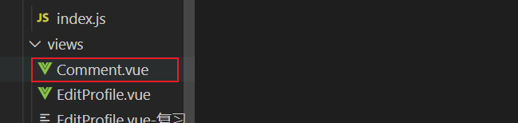
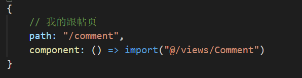
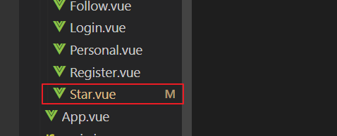
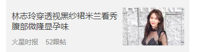

#  复习

#我的关注

## 新建我的关注页

配置路由

添加点击进去我的关注页面的入口，入口在个人中心页面`personal.vue`

添加path路径

然后在循环组件时候传递路径

最后`ListBar.vue`组件渲染`path`路径，这样的话点击按钮就可以跳转到我的关注页了

记得指定下props

## 页面的静态布局

## 请求关注的列表数据渲染

## 取消关注

# 我的跟帖

## 新建一个我的跟帖页面

1.创建页面文件

配置路由

跳转在上一个我的关注页时候已经配置，入口在个人中心页

## 页面的静态布局

## 请求我的跟帖的数据渲染

# 我的收藏

## 新建一个我的收藏页面

新建我的收藏页面

配置路由

不用配置入口的跳转，我们在个人中心页已经配置好

## 页面的静态布局

文章列表有两种布局方式，第一种是少于3张封面图片，

第二种是大于3张封面图片

所以我们在写静态时候两种布局都要写出来，然后通过后他的数据进行判断到底应该用哪一种，**不过现在我们的后台都是只有一种封面图片的数据，所以只渲染第一种布局方式就可以了**，第二种先暂时不处理，后面再处理

## 请求我的收藏的数据渲染