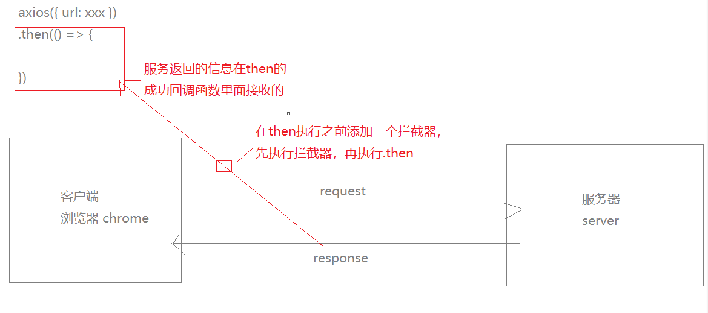
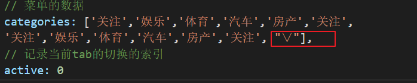
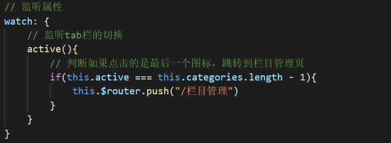
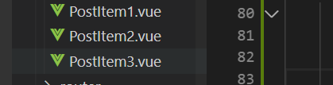

# 路由守卫添加访问权限


# axios拦截器

拦截的是response，[官网地址](https://github.com/axios/axios)




## 错误拦截

在`main.js`中添加拦截器处理请求错误的提示

```js
// 引入vant ui组件库
import Vant, {Toast} from 'vant';

// axios的响应拦截器 文档地址：https://github.com/axios/axios#interceptors
axios.interceptors.response.use(res => {
	return res;
}, error => {
	// 如果请求返回的结果是错误的，会进入到错误的处理函数中
	// error是js原生的错误对象，我们可以用过error.response可以获取到详细的信息
	const {statusCode, message} = error.response.data;

	if(statusCode === 400){
		Toast.fail(message);
	}

	return Promise.reject(error)
})
```


# 首页

1.新建首页

2.首页静态布局

​	1.van-tabs组件的使用

​	2.添加跳转栏目管理的按钮

3.文章列表模块组件封装

4.分页组件的使用


## van-tabs组件的使用

文档地址：<https://youzan.github.io/vant/#/zh-CN/tab#nian-xing-bu-ju>

`src/views/Index.vue`

```vue
<!-- tab栏切换 -->
        <!-- v-model：就是当前的索引值，是唯一的，比较类似于for循环的key -->
        <!-- sticky：是否使用粘性定位布局 -->
        <!-- swipeable: 是否开启手势滑动切换 -->
        <van-tabs v-model="active" sticky swipeable>
            <van-tab v-for="(item, index) in categories" :key="index" :title="item">
                <div>
                    <p>内容 {{ index }}</p>
                </div>
            </van-tab>
        </van-tabs>
```


## 添加跳转栏目管理的按钮

1.可以栏目数据的最后一位添加一个箭头



2.修改样式，保证跳转到栏目管理的箭头定位的右边

> 修改第三方组件的样式必须要在类名的前面加上 /deep/

3.监听tab的切换，如果点击了最后一个，跳转到栏目管理页





## 文章列表模块组件封装

主要是区分单张图片和多张图片和视频的列表组件



##  分页组件的使用

主要测试分页组件的加载更多

文档地址：<https://youzan.github.io/vant/#/zh-CN/list>

根据案例把它代码代入到我们的项目页面中，测试时候我们可以随便拿一个组件来测试，比如上面的`PostItem1.vue`

主要是了解下面3个属性的作用：

* v-model：loading表示是否正在加载
* finished：是否已经加载完成，如果finished的值等于true表示已经全部加载完毕
* @load：最重要的事件，拖动到底部的事件触发的事件

```vue
<!-- van的列表组件 -->
<!-- @load 滚动到底部时候触发的函数 -->
<van-list
          v-model="loading"
          :finished="finished"
          finished-text="我也是有底线的"
          @load="onLoad"
          >

    <!-- 假设list是后台返回的数组，里有10个元素 -->
    <div v-for="(item, index) in list" :key="index">
        <!-- 只有单张图片的 -->
        <PostItem1/>
    </div>
</van-list>
```

> list只是一个模拟的数据，后面请求接口时候再做传值，现在先写成静态的


