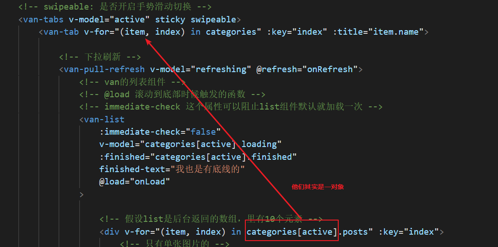
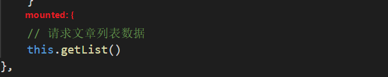
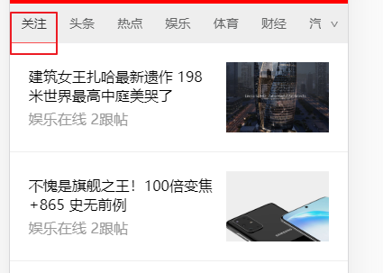

# 首页

`主要复习昨天内容`

## 代码优化

### 模板循环数据

### 在mounted中共用getList

## 添加关注栏目

请求文章数据，判断如果是关注栏目需要加上token

代码地址：[请求关注栏目的文章数据需要加上token](https://github.com/itcast-hsian/news-43/commit/eea3c1725b9acbc62ab17e22e89fa3a32f380ae1)

## 跳转返回原来的位置

依赖tabs的scroll方法

代码地址：

[获取文章列表滚动条的高度](https://github.com/itcast-hsian/news-43/commit/8eecde3ab21f7093cc5c50b25b296b7788ce89ea)

[当栏目切换时候滚动到原来的位置](https://github.com/itcast-hsian/news-43/commit/79f413a8929baba44fad703a45a02830f1acdbba)

