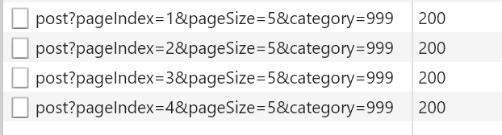
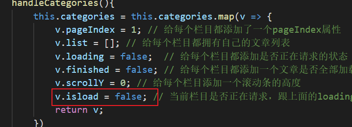
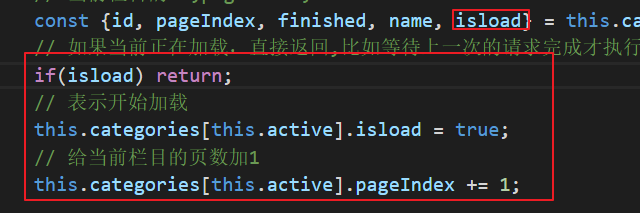
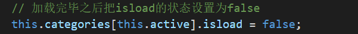
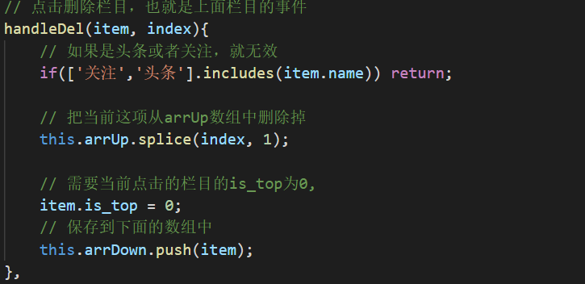
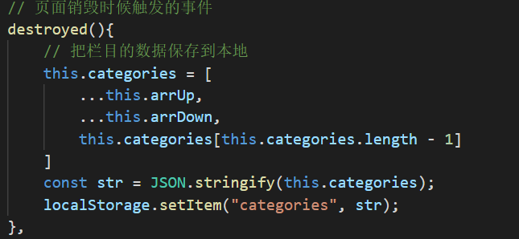
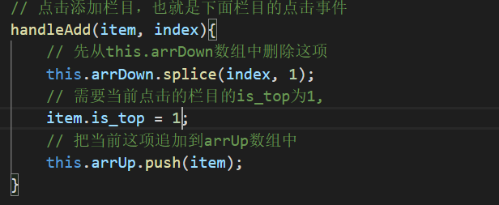
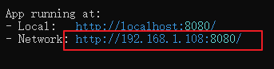
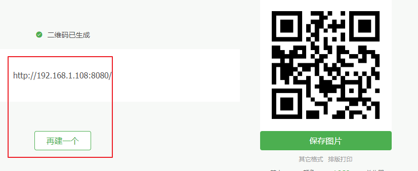

# 优化首页

页面如果不加请求限制，我们的页面在请求时候回一次性请求很多次

这里可以给每个栏目添加一个开关，开关就是限制请求的次数，只有当上一次请求完成才能进行下一次的请求

1.先添加一个状态声明

2.限制请求次数

3.请求完毕后要恢复状态，在getList的then中恢复，表示已经请求完成。

# 栏目管理

1.新建页面

2.写栏目管理页的静态布局

3.先把本地的categories数组拆分两部分。分别是is_top等于1和0的，（注意头条和关注栏目是不能编辑的）

4.点击删除栏目，把点击的栏目的is_top设置0，（注意头条和关注栏目是不能编辑的）

5.在页面离开后把最新的数组保存到本地

6.添加栏目，把点击的栏目的is_top设置1

# 手机预览电脑页面

1.保证手机和电脑再同一个网络下（同一个wifi），

2.在你启动项目时候可以看到第二个地址，把地址生成一个二维码

在这网站可以生成二维码<https://cli.im/>

3.手机扫描上面的二维码就可以看到你的开发页面

**4.如果手机访问不了需要关闭电脑的防火墙。**

# 搜索页

1.创建页面

2.搜索页的静态布局

