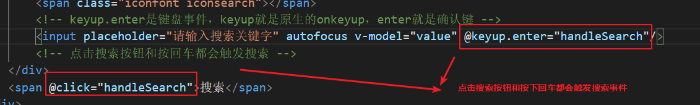
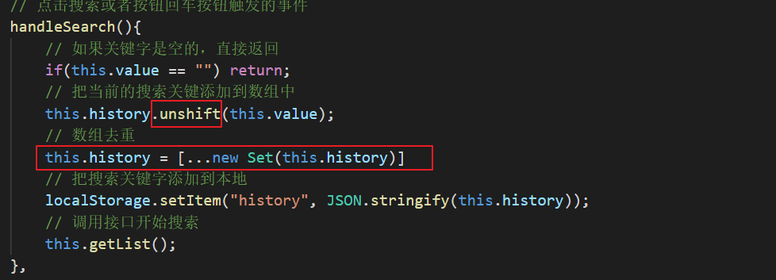
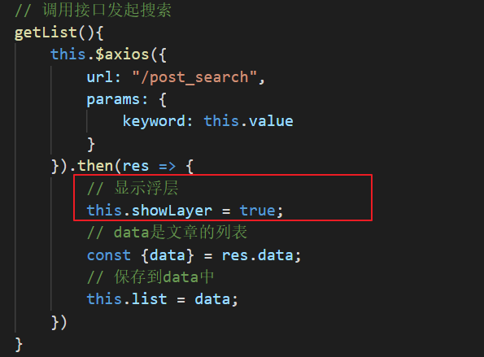
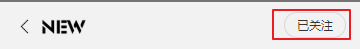
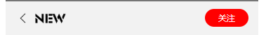
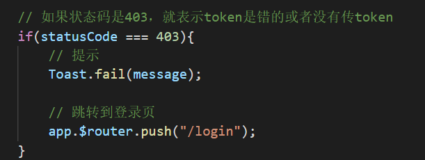
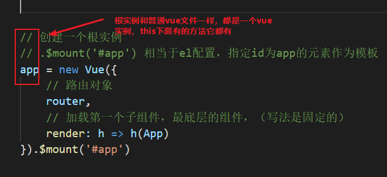
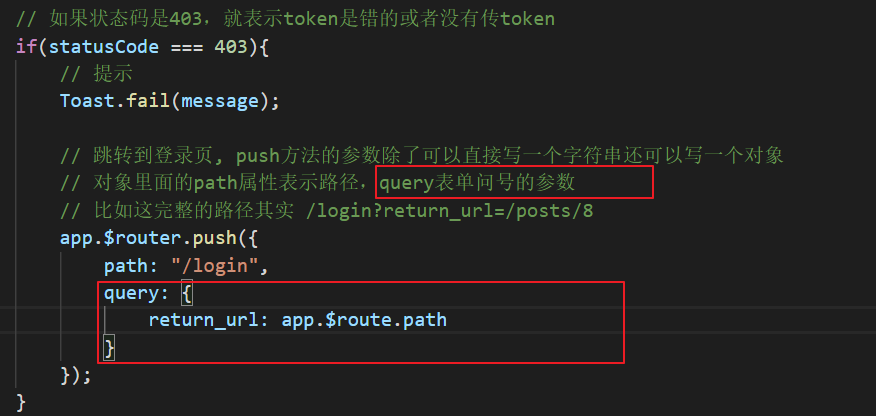
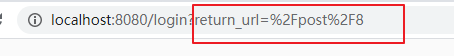
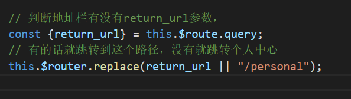

# 搜索页

1.搜索页的静态布局

2.搜索的历史记录

搜索关键字时候需要把关键字保存到本地

注意新的关键字添加到前面，还需要通过数组进行去重

3.根据关键字请求文章列表

注意显示浮层

# 详情页

## 普通文章的详情页静态布局

## 请求文章的详情，渲染页面

## 关注

如果当前是关注状态的话，显示一个灰色按钮

如果是未关注的状态就显示一个红色的按钮

> 注意：关注和取消关注是两个接口，`红色按钮就关注，灰色按钮就取消关注`

**关注时候需要token，需要在拦截器中处理403的错误**

`main.js`

如果当前的状态是403，就跳转到登录页，由于main.js不是一个Vue实例,所以不能调用this.$router,但是这个文件中有一个根实例，可以调用根实例下的$$router方法

**跳转到登录页时候记得把当前的路径带上，方便登录成功后返回到该页面**

跳转时候带上当前页面的路径

跳转过去之后我们的链接值显示成这样的

> 这里注意%2F就是斜杆

在登录成功之后需要返回之前的页面

`Login.vue`

