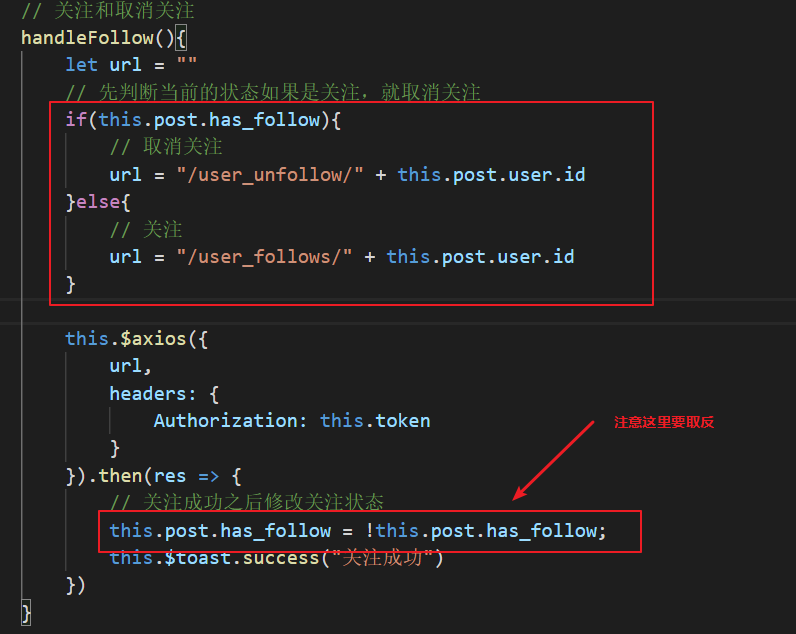
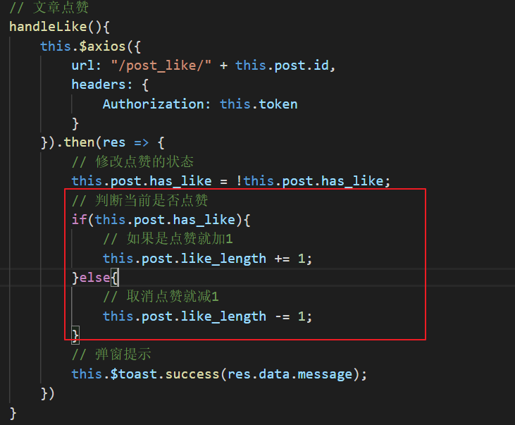
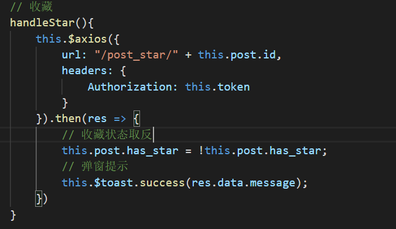
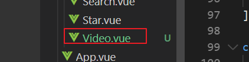
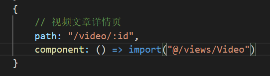
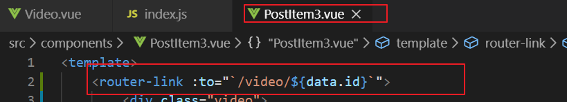
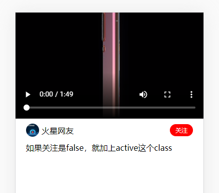
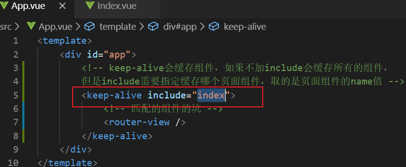
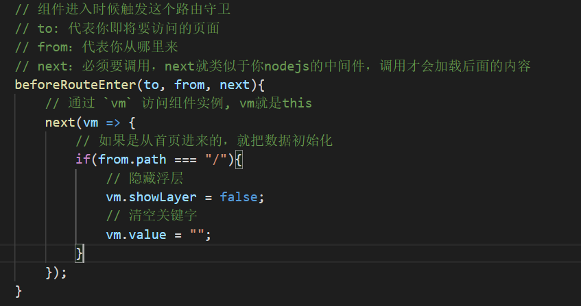
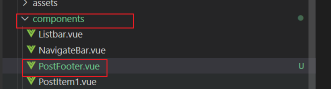

# 详情页

## 取消关注

## 点赞

点赞的后台接口有bug，必须要登录才返回点赞的次数（但是一般情况下我们只看个文章的点赞是不需要登录的）

大家可以忽略这个功能，不过要实现的话就在**登录的状态下操作**

## 收藏

# 视频详情页

## 新建视频详情页

1.先创建页面

2.配置路由

3.添加跳转链接

## 视频详情页的静态布局

## 读取文章的详情渲染页面

# keep-alive

官网地址：<https://cn.vuejs.org/v2/api/#keep-alive>

 

# 局部的路由守卫

官网地址：<https://router.vuejs.org/zh/guide/advanced/navigation-guards.html#%E7%BB%84%E4%BB%B6%E5%86%85%E7%9A%84%E5%AE%88%E5%8D%AB>

> beforeRouteEnter 不！能！获取组件实例 `this`，必须要在next的回调函数里通过参数来访问this

# 封装文章详情页的底部栏

# 替换文章的图片路径（正则）

正则教程（有空再看就好）<https://deerchao.cn/tutorials/regex/regex.htm>

