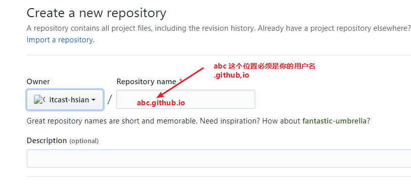
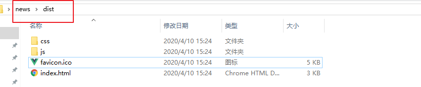

# 复习

1.actived生命周期的使用

2.使用组件内的守卫解决栏目管理返回的问题


# 跟帖页面

## 页面渲染

1.布局和样式

2.递归/vue组件递归

3.请求已有的评论数据进行渲染

4.楼层数据渲染

5.分页

6.底部发布评论的样式


## 发布评论

1.发布普通的评论（评论发布成功处理，弹窗，清空评论框的数据）

2.回复别人评论（点击楼层的回复按钮时候，会把当前用户的名字显示在输入框的placeholder中）

**重点：如果拿到你要回复评论的id**

* 外层的评论
* 楼层内部的评论

3.删除当前回复的人（点错或者不想回复他了，输入框失去焦点时候如果输入的内容是空的，就删除）

4.楼层内部的评论


# 把项目上传到github page

github page(码云也有这个功能) 提供一个免费的空间给我们存放静态的文件，可以通过执行域名来访问（比如van-ui的官网，已xxx.github.io结尾的网站）

**1.在你的github中创建一个新仓库  假设你的用户叫 `abc`**



> abc 是用户名 （比如我们用户名叫做itcast-hsian, 所以我的仓库名必须是 itcast-hsian.github.io）
>
> .github.io是固定的


**2.打包你的项目**

```
npm run build
```

打包完成后，会出来dist文件夹




**3.把dist文件里面的文件上传第一步新建的仓库中**

https://abc.github.io 通过这个地址就可以访问到你的页面 （abc要替换成你的用户名）


# 码云的git page

教程： <https://blog.csdn.net/qq_36667170/article/details/79318578>


