# 黑马头条移动端项目结束


# 黑马头条的管理后台

1. 创建项目（element）
2. 登录页
3. 文章列表页
4. 发布文章

## 什么是管理后台

管理后台就是一个用来可以管理前端页面数据展示的一个后台系统，里面可以包含数据统计，数据的管理，一般只针对给**官方人员**来使用，不能给大众使用


## 创建项目

使用vue cli来创建项目

1.输入项目名


2.选择手动安装

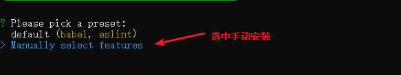

3.手动选择的选项

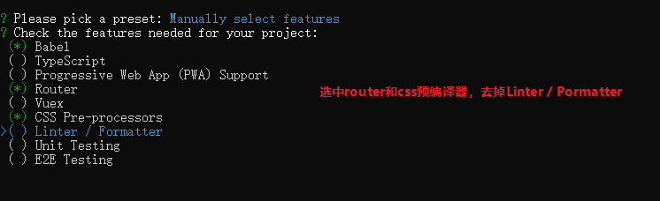

4.选择less编译器

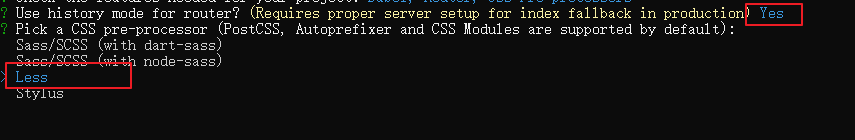

5.直接全部回车，等待安装

6.安装成功后启动项目

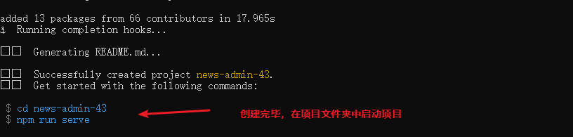


## 删除项目中不必要的文件

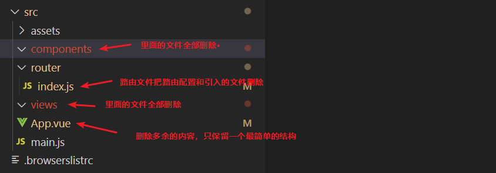

修改后的两个.

`App.vue`

```vue
<template>
  <div id="app">
    首页
  </div>
</template>

<style lang="less">

</style>

```

`router/index.js`

```js
import Vue from 'vue'
import VueRouter from 'vue-router'

Vue.use(VueRouter)

const routes = [

]

const router = new VueRouter({
  mode: 'history',
  base: process.env.BASE_URL,
  routes
})

export default router
```


## 添加element ui组件库

官网地址：<https://element.eleme.cn/#/>

1.安装下载

```
npm i element-ui -S
```

2.完整导入element ui组件库

`main.js`

```js
import Vue from 'vue'
import App from './App.vue'
import router from './router'
// 1.导入element ui组件库（和van-ui是一样，van是移动端的，element是pc端的）
import ElementUI from 'element-ui';
// 2.element ui的样式
import 'element-ui/lib/theme-chalk/index.css';

Vue.config.productionTip = false
// 3.注册element ui的组件
Vue.use(ElementUI);

new Vue({
  router,
  render: h => h(App)
}).$mount('#app')

```

3.在`App.vue`中测试组件导入是否成功

```vue
<template>
  <div id="app">
    首页
    <el-button type="primary">主要按钮</el-button>
  </div>
</template>
```

如果看到一个蓝色的按钮，表示引入成功

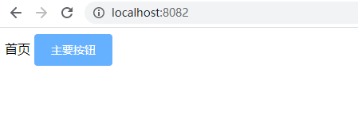

> 同类型的组件库，还有bootstrap-vue、ant design vue（阿里巴巴蚂蚁金服）


## 项目的github地址

<https://github.com/itcast-hsian/news-admin-43>


# 登录页 

1.创建登录页

2.登录页的静态布局

3.发送登录请求


## 登录页的静态布局

根据element ui的典型表单来创建一个登录页的表单，复制过来后删除掉不必要的代码

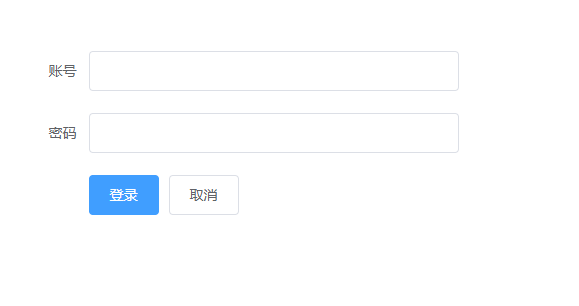

## 在项目中安装axios

1.安装下载

```
npm install axios
```

2.导入到原型

`main.js`

```
import axios from "axios"
Vue.prototype.$axios = axios
```


3.配置一个基准路径

```
axios.defaults.baseURL = "http://localhost:3000"
```


## 发送登录请求

弹窗提示组件的文档地址：<https://element.eleme.cn/#/zh-CN/component/message>


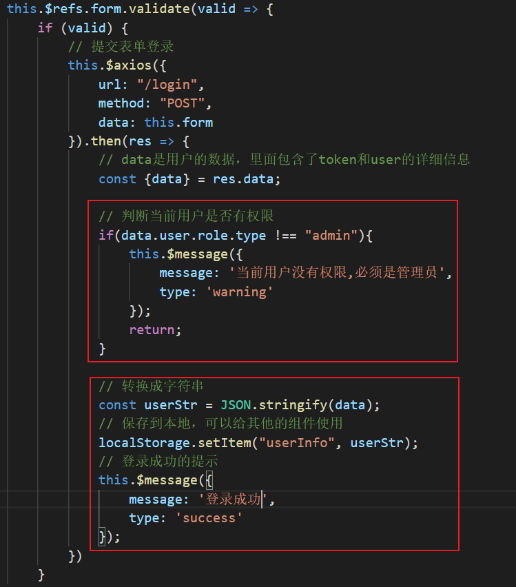

# 首页

## 首页的整体布局

1.使用element ui的container布局容器 <https://element.eleme.cn/#/zh-CN/component/container#chang-jian-ye-mian-bu-ju>

使用列表中的第四个

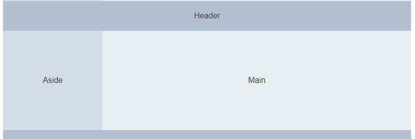

> 需要调用下样式高度


## 首页的内容布局

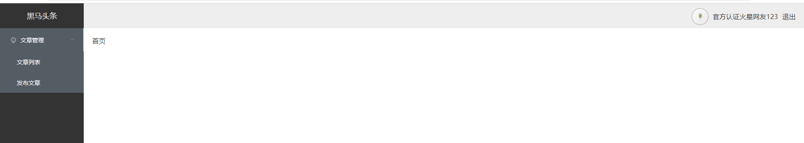

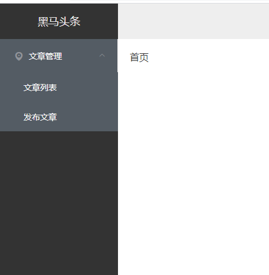

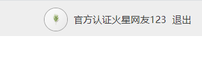


