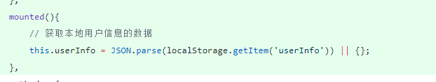
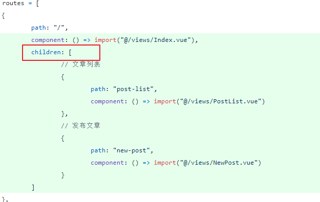
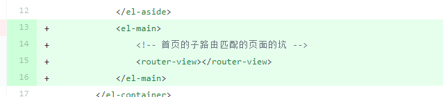
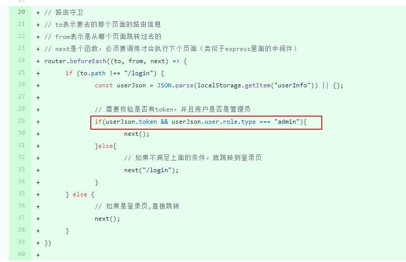
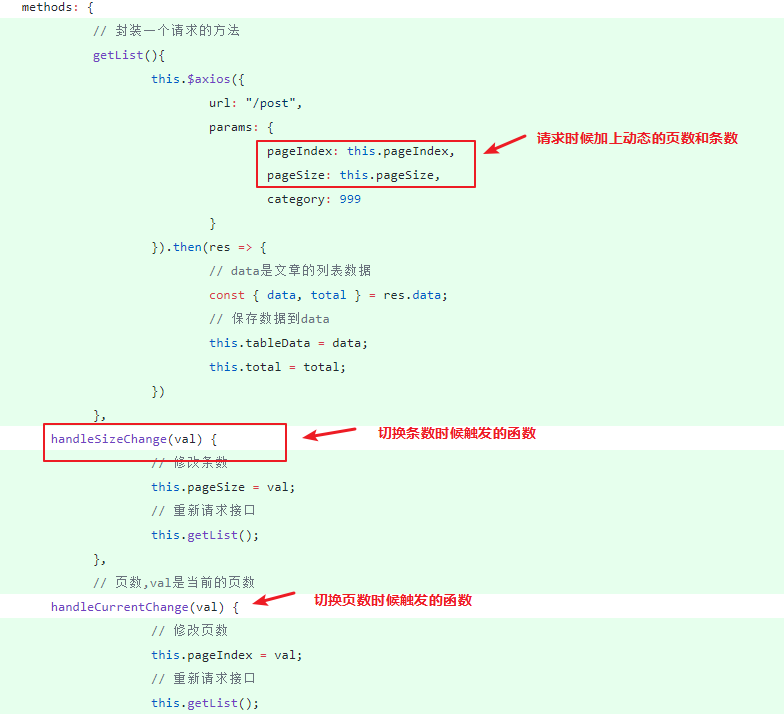
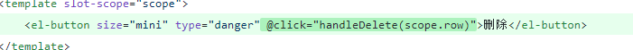
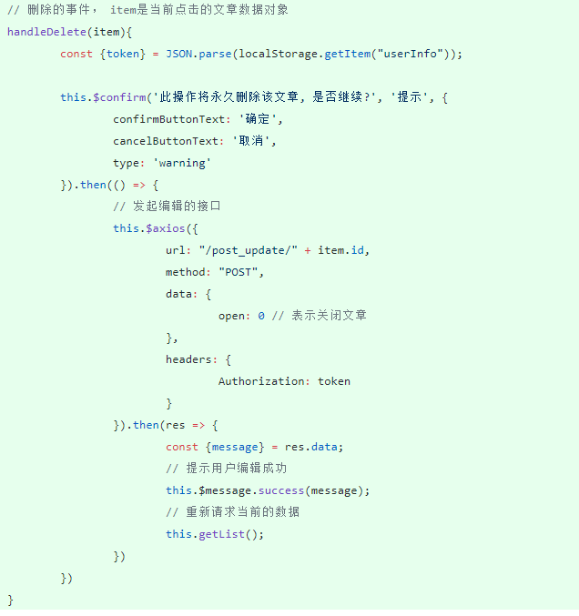
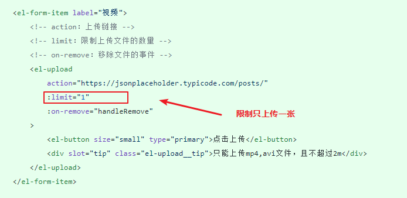
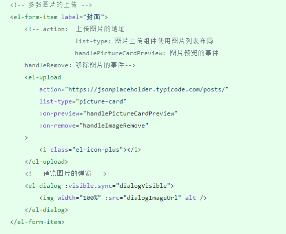

# 管理后台

1.替换下用户的数据

2.新建页面的子路由

3.路由守卫监控有权限的用户才能进去到页面

4.文章列表页

​	1.分页功能

​	2.编辑功能（关闭文章）

##替换下用户的数据

`src/components/header.vue`

## 新建页面的子路由

1.创建路由配置

`src/router/index.js`

2.在首页组件中添加一个坑位

`src/views/Index.vue`

3.在侧边栏添加链接

`src/components/aside.vue`

## 添加路由守卫

##  文章列表页

### 分页功能

​	页面切换的事件里面做三件事

 	1. 修改页数和显示条数
 	2. 请求文章列表的接口
 	3. 替换下数据

## 编辑删除功能

1.给按钮绑定一个事件

2.事件函数

## 发布文章

### 视频上传的输入框

文档组件地址：<https://element.eleme.cn/#/zh-CN/component/upload#dian-ji-shang-chuan>

### 富文本输入框

文档地址：

<https://github.com/davidroyer/vue2-editor>

先采用最简单的使用，先不考虑自定义上传图片

<https://github.com/davidroyer/vue2-editor#example---basic-setup>

### 多张图片上传

文档地址：<https://element.eleme.cn/#/zh-CN/component/upload#zhao-pian-qiang>

这里使用照片墙的功能，代码都是复制粘贴的，但是注意handleRemove事件名不要和上传视频的按钮发生冲突,需要改下名字

