# 发布文章

## 发布普通的文章

### 获取栏目的数据

在组件加载完毕后先请求栏目的数据，然后删掉头条栏目

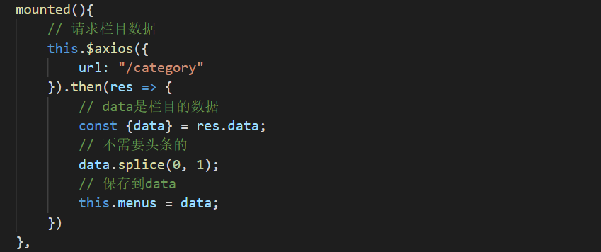

在页面中渲染栏目数据，渲染时候label是多选框被选中时候添加到数组的值，所以label应该取栏目id的值

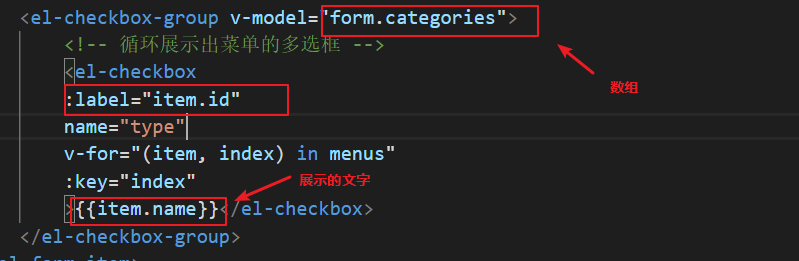

##  封面图片的上传

1.在上传成功的回调 函数里面可以获取到当前的图片列表

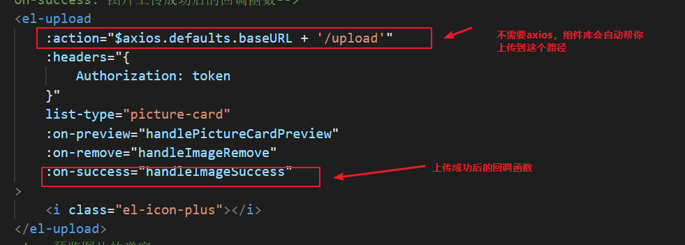

2.注意保存图片的列表

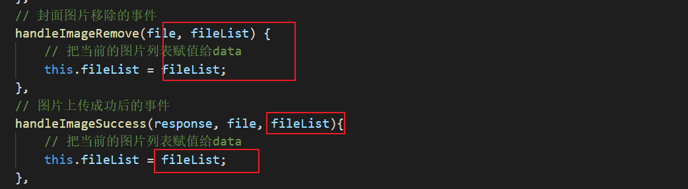

## 发布普通的文章

在发布文章之前要做两件事

1.转换栏目和 图片列表的格式为接口需要的格式

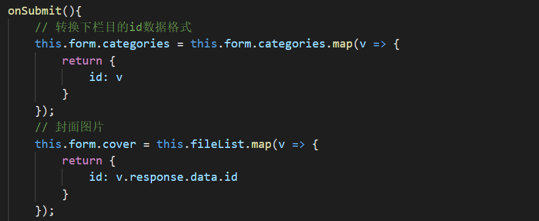

2.表单的验证，一些字段不能为空

3.最后可以发布文章

## 发布视频文章

视频上传和封装图片上传的用法差不多

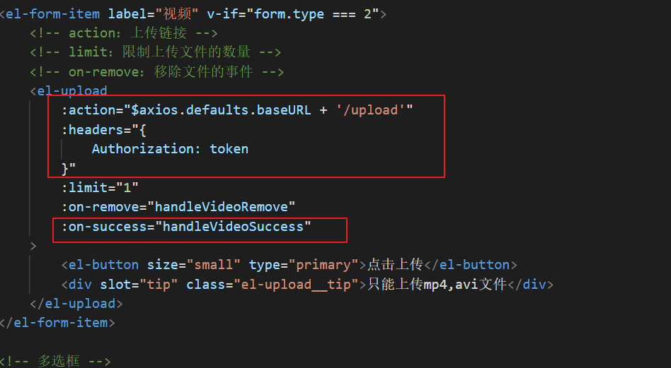

再视频上传成功之后把视频的url赋值给文章的content，因为视频的文章只有一个视频的链接

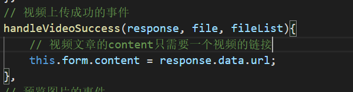

其他东西和普通的文章是共用的

# 编辑文章

**数据回显**

## 创建编辑文章页面

添加路由配置

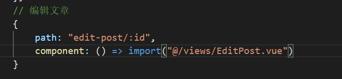

添加跳转链接，主要是带上id

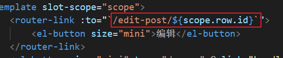

## 请求文章的数据进行回显

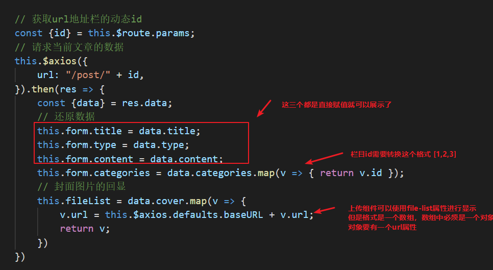

注意下如果是新上传的图片，和已经存在图片格式不一样，虽然有都有url，可以让图片展示出来，但是id的位置不一样

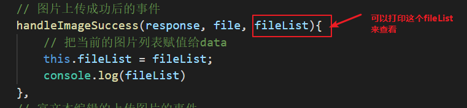

所以最后再上传图片时候 需要做一个判断

`onSumit`事件里

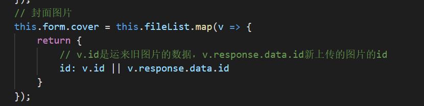

