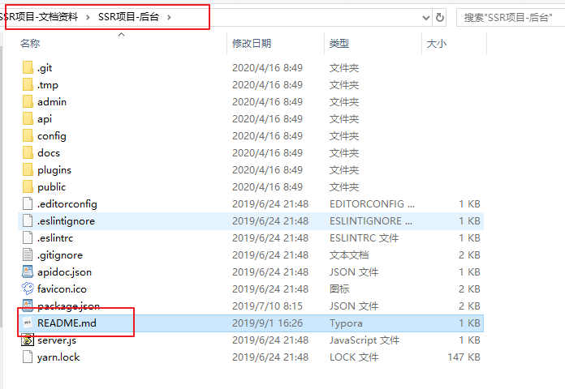
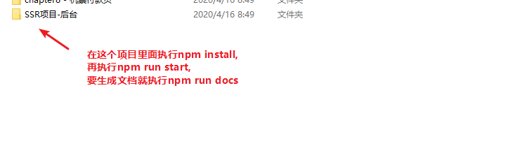

# npm和npx的区别

在我们安装nodejs时候会有两个系统命令

npm和npx, 下面就是他们的区别：

> 比如下面的命令 npx create-nuxt-app xianyun
>
> 1.先下载create-nuxt-app这个包，
>
> 2.下载完立即执行 create-nuxt-app xianyun这个命令，
>
> 3.执行完成后立马删除

# nuxt项目的路由

nuxtjs项目不需要自己配置路由，它的路由规则会根据pages文件夹里面的文件名自动生成，默认首页是index.vue

比如<http://localhost:3000/>自动匹配pages/index.vue

<http://localhost:3000/abc> 匹配的是 pages/abc.vue

# 今天内容

1.复习好promise和async await，把上午的案例都写一遍

2.创建好项目（记得选中npm element和axios）

3.配置项目 (根据文档的第二章)

4.本地配置后台

按照readme.md步骤去配置后台

