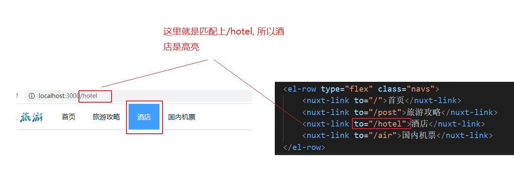
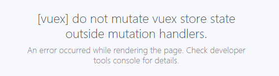
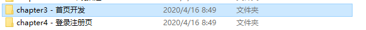

# 头部菜单高亮的问题

nuxt框架会自动的匹配nuxt-link标签的链接，如果to属性的链接和地址栏匹配的话，就会给该标签添加一个`nuxt-link-exact-active`这个class



# vuex的使用

## 新建仓库文件

`store/user.js`

```js
// 存放仓库该分类（user）下的数据, export const state = {}是固定的格式
export const state = {
    username: "张三"
};
```


## 获取

随便在一个组件可以通过

```js
this.$store.state.user.username
```

> user是js文件模块的名字, username是该文件下state的属性 


## 存储修改

### 错误的方式



**`我们不能使用直接赋值的方式来修改store的属性`**

```
this.$store.state.user.userInfo = data;
```

否则会报上面的错误

### 在mutation声明一个函数

```js
// 修改state中的数据 export const mutations = {}是固定的格式
// store的数据不能直接修改，必须要使用mutations来修改
export const mutations = {
    // 声明一个函数，函数名可以随便起
    // 该函数有两个参数，第一个参数是上面state(固定的), 第二个参数是传入的参数(不固定)
    setUserInfo(state, data){
        // 随意的修改state的属性
        state.userInfo = data;
    }
}
```


### 在任意的组件中调用mutations的方法

```js
// 通过this.$store.commit调用mutations的方法
this.$store.commit('user/setUserInfo', data);
```


# 今天内容

进入进度, 首页和登录页前4部分：




