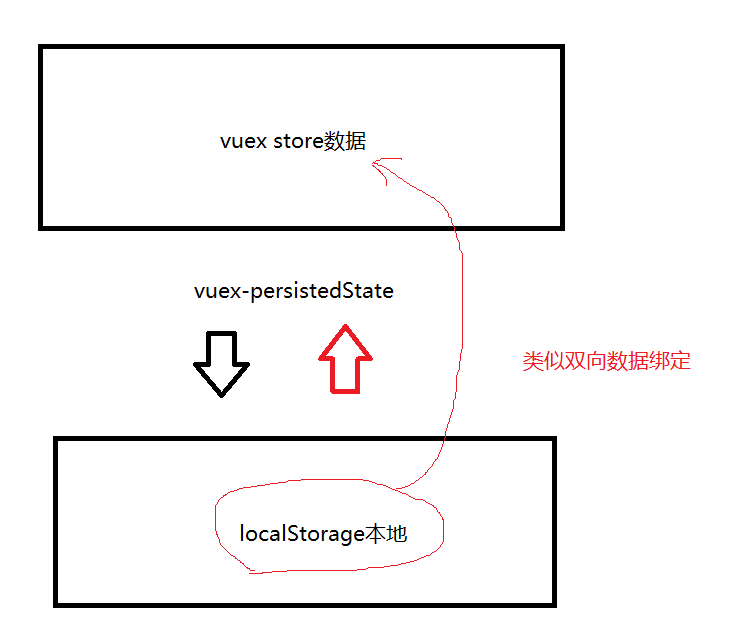
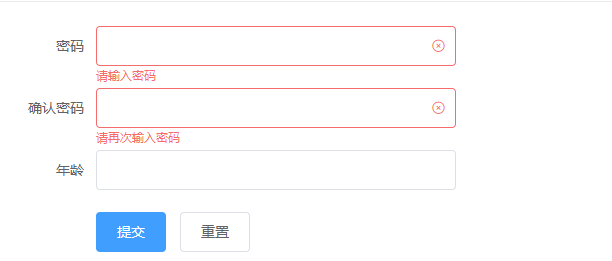

# 今天内容

## vuex的actions属性`!!!`

1.actions的作用是什么？为什么要用。

```
组件或者项目的一些公共的方法，主要是一些异步的请求可以统一的封装到actions中，方便项目和组件调用
```

2.怎么声明actions的方法

```js
// 比如在user.js中声明一个登陆的方法
export const actions = {
    // 登陆
    // 第一个参数必须是store，第二个参数由外部传入（也就是通过dispatch调用时候传入的）
    login(store, data){
        // 发起请求
    }
}
```

3.组件如何调用actions的方法

```js
this.$store.dispatch("模块名字/方法名")

// 比如上面的例子
this.$store.dispatch("user/login")
```


## Vuex-persistedState插件的使用

使用方法可以github文档或者我们自己的文档，使用的方法很简单，原理只需要记得下面这幅图，`可以简单的理解为插件把本地和store进行双向绑定的关系`




## element的自定义校验规则

文档地址：<https://element.eleme.cn/#/zh-CN/component/form#zi-ding-yi-xiao-yan-gui-ze>

对于这个功能只需要记得element下有这个方法就行，用到的时候再回来看文档




## 把发送手机验证码和注册请求提取到actions


