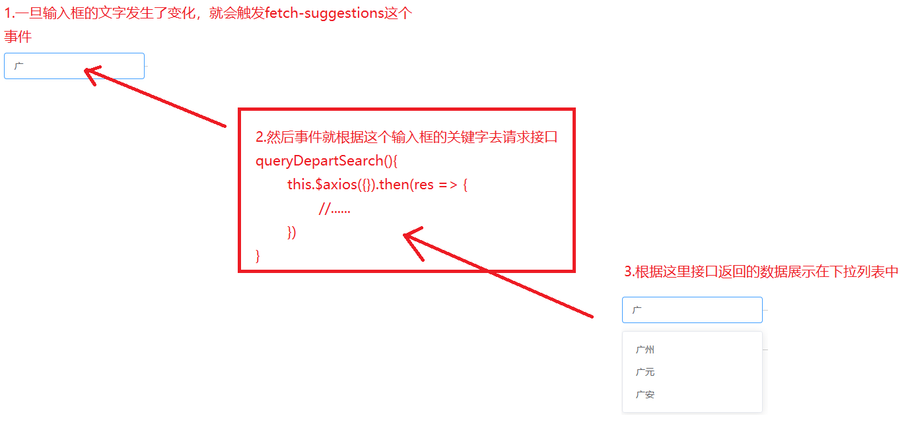
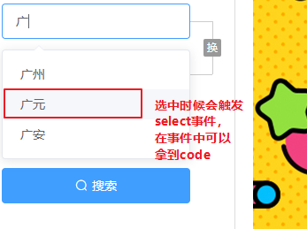
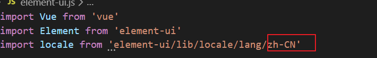
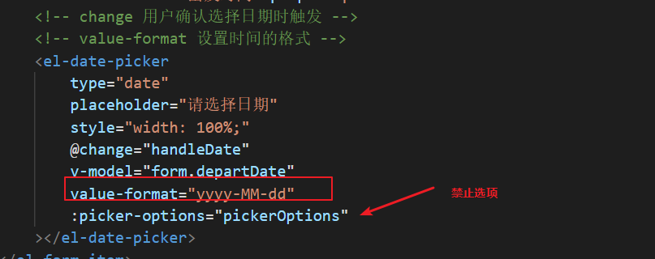
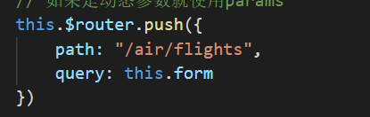

# 复习

1.vuex

2.错误的拦截


# 机票首页

1.搜索机票表单

## 出发城市下拉推荐列表

主要是el-autocomplete这个输入框组件的使用，监听输入框的输入，根据输入框的值请求城市接口，把城市列表展示在下拉列表中

组件文档：<https://element.eleme.cn/#/zh-CN/component/input#yuan-cheng-sou-suo>

```
// 重点的事件时fetch-Suggestions
```



> 注意：
>
> 1.输入框必须有值的情况下才发起请求
>
> 2.请求回来的数据格式不对，对象里面缺少了value属性，并且城市的名字多了一个市字，需要装换下


## 获取城市代码

### 在下拉列表选中时候获取城市代码



> 具体的实现查看代码中select事件

### 如果用户不选下拉列表。就默认选中第一个

> 在输入失去焦点时候默认选中第一个

```js
// 出发城市失去焦点时候默认选中第一个
        handlDepartBlur(){
            if(this.departCities.length > 0){
                this.form.departCity = this.departCities[0].value;
                this.form.departCode = this.departCities[0].sort;
            }
        },
```

 到这里已经可以拿到5个参数前4个了


## 获取日期

日期的组件要组件下面几个地方

1.把element转换为中文

`plugins/element-ui.js`



2.日期格式




## 表单验证

定义rules, rules中的trigger可以用任意的字符覆盖，主要是我们希望点击按钮时候才触发验证

验证通过就直接跳转

跳转时候使用对象的方式，这个写法大家 记下




