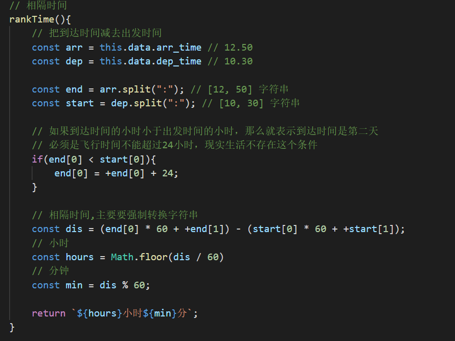
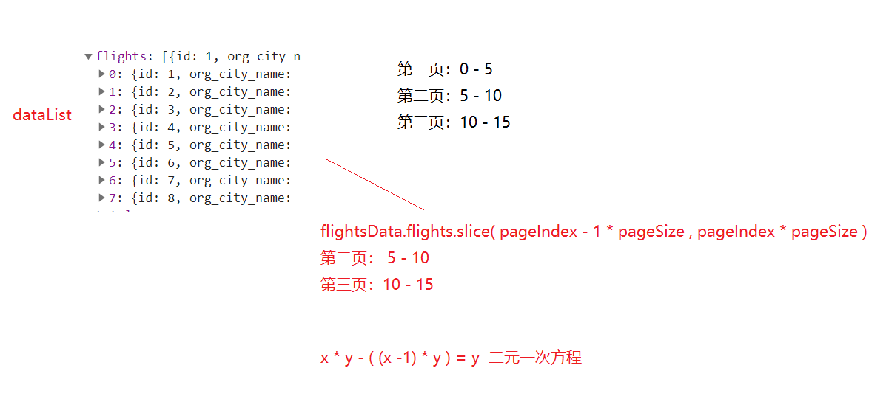

# 首页的搜索框

1.去掉空白值的时候去掉下拉框

```js
queryDestSearch(value, cb) {
            // // 如果value值空的，就不需要请求
            if(!value){
                cb([]);
                return;
            }

```

> 重点是这个: `cb([]);`


2.如果输入框为空，去除默认选中的第一城市

```
queryDepartSearch(value, cb) {  
            
            // 如果value值空的，就不需要请求
            if(!value){
                // 禁止输入框的值是空的时候显示下拉框
                cb([]);
                // 如果输入框的值是空的话把之前的城市列表删除掉
                this.departCities = [];
                return;
            }
```

> 重点是这个: `this.departCities = [];`

3.出发城市和到达城市的搜索函数的封装

参考代码：[出发城市和到达城市的搜索函数的封装](https://github.com/itcast-hsian/xianyun-43/commit/1eac2bd34600adee1f1a72da4ddf2ded41f1f01a)

4.城市切换


# 机票列表页

## 机票列表渲染

1. 先根据url的参数请求回来机票列表'
2. 拿到数据之后直接渲染

> 需要仔细的看下对应的字段


## 计算相隔时间

把到达的时间减去出发的事件 ( 数学相隔时间转换 )




## 分页

1.为什么要在前端做分页

> 目的是为了减少服务器请求的次数，但是要特别注意，只有我们现在这个机票功能下可以这样实现，如果是文章列表千万不能这样实现，要使用传统的分页请求后台的数据（参考黑马头条接口要带上pageIndex和pageSize）

页数切换的公式




 


