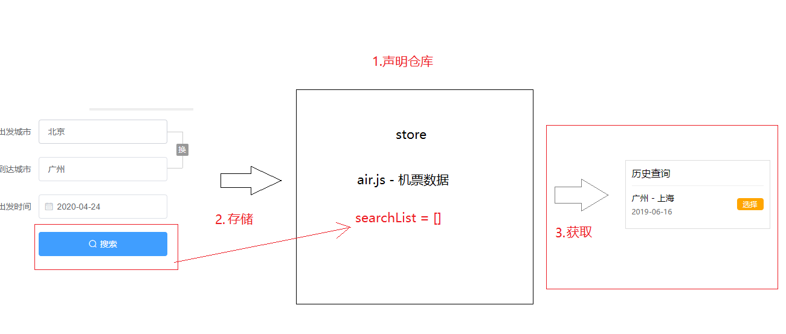
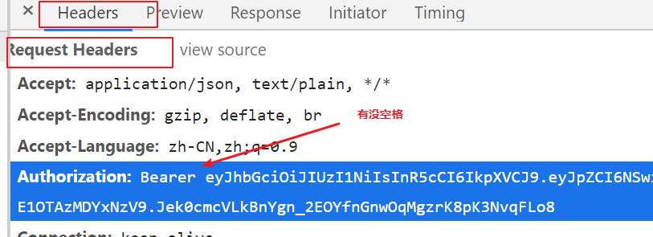

# 机票列表的侧边栏

## 把搜索数据保存到store

可以把搜索记录的数据存放到store中,所以有以下的步骤

1.创建一个仓库的文件air.js

> 注意需要创建: state和mutations

2.在点击机票查询搜索按钮时候把当前表单的数据保存到store中

> 点击搜索按钮时候调用mutations的方法

3.在历史查询列表中读取store的数据

> 读取要注意下点击时候的日期，因为历史日期很可能是今天之前的，所以我们不可能买到过期的机票

## 点击历史记录时候操作

1.判断日期

2.点击url路径发生变化时候组件不会刷新，所以就导致数据也不会刷新，需要监听url参数的变化

* 使用watch来监听重新请求数据
* 使用beforeRouteUpdata来监听重新请求数据

> watch和beforeRouteUpdate没有可比性，不要去比较他们，watch可以监听实例下的所有属性。beforeRouteUpdate只能监听跳转到相同页面的路由，应用的范围很小

# 机票订单

1.根据航班id和座位id来获取数据，渲染保险数据

2.拼接表单需要的数据（乘机人，保险id，手机验证码）

3.提交订单，提交订单时候遇到403的错误，403的错误可以到plugins/axios.js中统一处理

登录成功后返回上一个页面

4.记得给提交订单的接口加上token, token字符串的前面必须加上Bearer声明，后面注意一定要有空格

