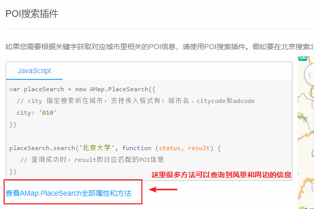

# 高德地图

## 注册登录

直接网站的右上角

## 高德地图web的地图js使用前准备

> \1. 首先，[注册开发者账号](https://lbs.amap.com/dev/id/newuser)，成为高德开放平台开发者
>
> \2. 登陆之后，在进入「应用管理」 页面「创建新应用」
>
> \3. 为应用[添加 Key](https://lbs.amap.com/dev/key/app)，「服务平台」一项请选择「 Web 端 ( JSAPI ) 」


## 创建新应用并且拿到key

* 点击控制台


* 添加key时候一定要勾选web js


## 创建第一个地图

详细的文档参考官网的：

<https://lbs.amap.com/api/javascript-api/guide/abc/prepare>


## 地图标记和多标记

文档地址：

<https://lbs.amap.com/api/javascript-api/guide/overlays/marker>

地图点标记分为单个和多个标记，在我们的项目中是使用多个标记

一个基本的案例（文档有很详细的例子）

1.先创建好点标记对象

```js
var marker = new AMap.Marker({
    position: new AMap.LngLat(116.39, 39.9),   // 经纬度对象，也可以是经纬度构成的一维数组[116.39, 39.9]
    title: '北京'
});
```

2.管理到已经存在的地图对象中

```
map.add(marker);
```

> 如果是多个传入一个数组

```
map.add([marker1, marker2]);
```


**需要使用到自定义点标记**

可以定义标记的内容

```js
var marker = new AMap.Marker({
    position: new AMap.LngLat(116.39,39.9),
    offset: new AMap.Pixel(-10, -10),
    icon: '//vdata.amap.com/icons/b18/1/2.png', // 添加 Icon 图标 URL
    title: '北京'
});

map.add(marker);
```


## 导航

* 自驾
* 景点周边搜索

**自驾**

文档地址：<https://lbs.amap.com/api/javascript-api/guide/services/navigation>

> 可以参考课堂代码简单实现一下，不写也没关系，只是体验下这个导航的功能。

**景点周边搜索**

景点周边搜索会应用在（酒店详情页）的周边信息查询

文档地址：<https://lbs.amap.com/api/javascript-api/guide/services/autocomplete>

使用官方文档的poi搜索的方法




## 当前城市定位

文档地址：<https://lbs.amap.com/api/javascript-api/guide/services/geolocation>

直接复制官网的地址就可以使用了，但是第一个浏览器的定位在某写chrome浏览器会失败，可以用第二个ip查询


