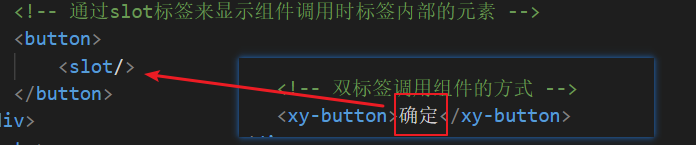
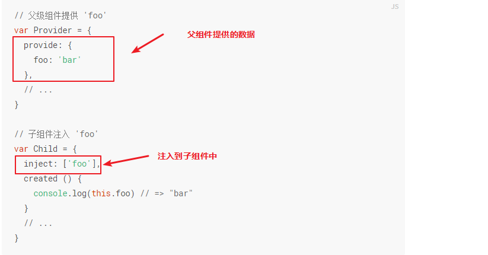
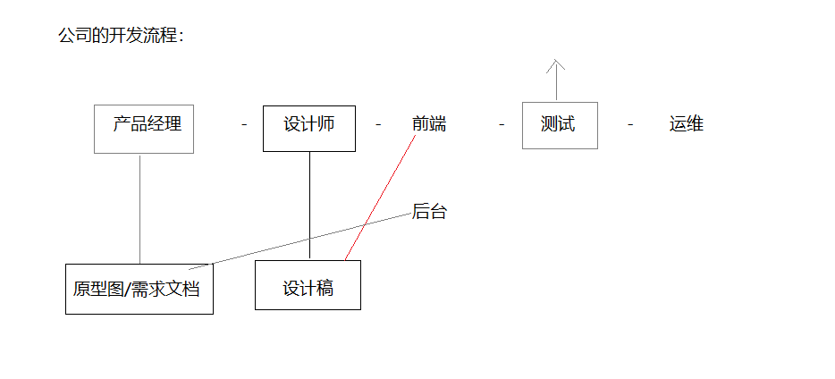

# 复习下组件递归

> 当我们不确定数据下面到底有多少级的时候，就需要使用递归!!!!!!!!!!!!!


下面这些东西都是知道就行，**项目中几乎不会用的**

# 过滤器

官网地址：<https://cn.vuejs.org/v2/guide/filters.html>

`pages/other/filter.vue`

```vue
<template>
    <!-- 过滤器 -->
    <div style="padding: 100px">
        <h2 style="padding-bottom: 20px">过滤器</h2>

        <!-- 推荐用这个方式  -->
        <!-- <p>
            {{ Number(price).toFixed(2) }}
        </p> -->

        <!-- 1.在插值表达式中，竖线表示后面可以接上过滤器函数，tofixed就是一个过滤器的函数 -->
        <!-- price的值会经过tofixed的改造，最终展示出过滤器return的值 -->
        <p> {{ price | tofixed }} </p>
    </div>
</template>

<script>
export default {
    data(){
        return {
            price: 99
        }
    },
    // 2.过滤器函数
    filters: {
        // value参数就是使用了改过滤器的值
        tofixed(value){
            return Number(value).toFixed(4);
        }
    }
}
</script>
```


# 自定义指令

官网地址：<https://cn.vuejs.org/v2/guide/custom-directive.html>

`pages/other/directive.vue`

```vue
<template>
    <!-- 自定义指令 -->
    <div style="padding: 100px;">
        <!-- 自定义指令的作用就是用来获取dom元素，其实一般都是使用ref就可以了 -->
        <div v-red class="box"></div>
    </div>
</template>

<script>
export default {
    // 1.声明自定义指令
    directives: {
        red: {
            // 调用该指令的节点元素，在加载后执行
            inserted: function (el) {
                el.style.background = "red";
            }
        }
    }
}
</script>
```


# 混入

官网地址：<https://cn.vuejs.org/v2/guide/mixins.html>


项目组件比较的少用，一般用于公共组件的开发(element-ui/ vant-ui )

> Vue 组件中的可复用功能，也就是（data/mounted/methods）这些属性可以复用

1.先声明一个混入的文件

`assets/mixin.js`

```js
// 把可以复用的数据提取出来到这个单独的文件，然后哪个组件需要用到下面这些属性，就混入进去
export default {
    data(){
        return {
            message: "hello"
        }
    }
}
```

2.把上面的混入文件混入进来

`pagesother/mixin.vue`

```vue
<template>
    <!-- 混入.混入一般用于多个组件公用一份数据或者函数 -->
    <div style="padding: 100px"> 
        混合的组件1: {{message}}
    </div>
</template>
<script>
// 导入公共的混入的数据
import mixin from "@/assets/mixin"

export default {
    // 混入数据
    mixins: [mixin]
}
</script>
```


# 插槽

官网地址：<https://cn.vuejs.org/v2/guide/components-slots.html>


项目组件比较的少用，一般用于公共组件的开发

> slot比较类似router-view，就是个 坑位，router-view是显示路由匹配到的组件，slot是传入什么就显示在slot这个坑位上。




# 依赖注入

官网文档：<https://cn.vuejs.org/v2/api/#provide-inject>


一般不用于业务类型的项目开发，一般用于公共组件的开发， 通常情况还是使用props，因为props是可控的，我们可以明确的知道组件需要什么样的数据，不需要和父组件有一定的关联

依赖注入有一个最典型的组件（el-form和el-form-item，这两个组件必须要搭配使用的）

> 依赖注入解决的是组件传值的问题




# 项目实战

## 公司的开发场景

**手机APP :**

* 安卓端：java / kotlin
* IOS：object-c / swift 
* 混合开发：
  * 用网页的技术来开发APP，但是传统的网页只能在浏览器里面打开，所以混合技术就是在网页的外		面`套一层壳（cordova，ionic）发布成apk文件`，就是一个混合app
  * 优点：一个会前端的人能搞定app和网页，成本低
  * 缺点：页面非常的不流畅，而且调用设备接口有兼容问题 （体验非常差）

> `混合开发并不是完全由网页组成，有部分会用系统原生的组件`

**前端相关的混合技术**

```
vue: [uniapp]/weex[阿里巴巴 已经捐给apache阿帕奇基金会]/nativescript（国内用的很少，国外很多）

react: [react-native | 携程]（目前有非常多的成熟的方案，也是目前公司首选的混合开发技术）

angular: nativescript / ionic

flutter: google 去年才发布的正式版，基于dart语言（闲鱼app就是flutter开发的）
```


**游戏： **

* 语言：c/c++
* 框架：cocos2d-x, unity-3d,xxxxx
* web：canvas


**移动端（公众号）:**

* 公众号就是一个普通网页开发 >  vue / vue-router / vuex/vue-cli | nuxtjs /

> 所谓的`公众号网页只是在微信浏览器里面打开的网页`，可以通过微信的授权获取到用户信息。网页中只需要导入一个js文件（jssdk）就可以调用授权的接口了（需要企业资格，300块一年费）

**小程序： **

> 小程序比起公众号网页多了以下功能：
>
> 有信息推送功能
>
> 调用摄像头
>
> 调用录音
>
> 调用扫一扫，摇一摇
>
> 微信现有用户的功能小程序都可以用
>
> 小程序最大的缺点就是怕举报（腾讯说了算，南山必胜客）

PC端：


## 项目实战要做什么



> 项目实战的意义是`为了大家有一个模拟公司的开发环境,在公司里面会做什么`
>
> 我们的工作就是根据产品经理给出的需求和设计，实现前端页面，并且调用后台的接口数据

* 拿到页面需求之后先创建好文件路由之类的
* 实现页面的静态
* 调用接口实现交互

**组长任务**

* 分配好小组每个人负责的页面
* 项目协作方式 （今天一定要有一个完整的首页+登录注册+国内机票，后面就是往该项目中添加新内容）
* 奖励


